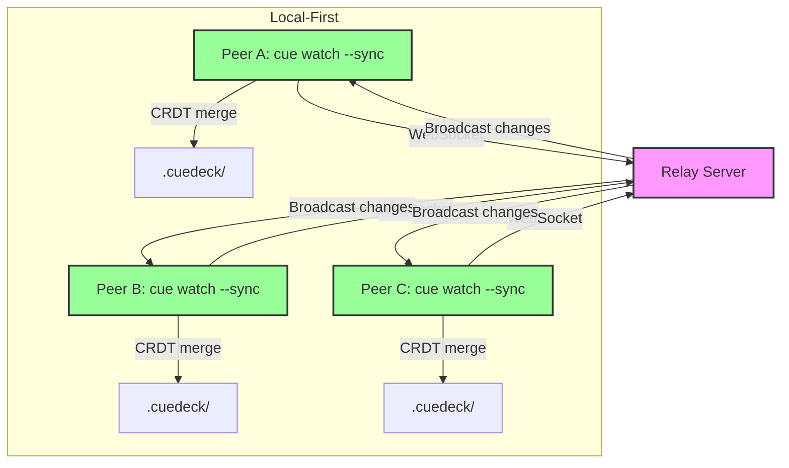

# ADR-008: CRDT-Based Peer-to-Peer Sync

**Status**: Accepted  
**Date**: 2026-01-03  
**Deciders**: Core Team  
**Supersedes**: Extends ADR-007 with P2P capability

---

## Context

**Background**:

- Phase 6 (ADR-007): Optional cloud backup to S3/GCS/Azure for individual users
- Phase 8 (this ADR): Real-time team collaboration for multi-user workflows

**Requirements**:

1. Local-first (ADR-004): No mandatory centralized server
2. Real-time sync: <500ms latency between peers
3. Offline-capable: Work offline, sync when reconnected
4. Conflict resolution: Deterministic, no data loss
5. Privacy: End-to-end encryption, optional relay

---

## Decision

Use **CRDT (automerge-rs) + WebSocket relay** for peer-to-peer synchronization.

### Architecture



---

## Rationale

### Why CRDT (automerge-rs)?

**Comparison Matrix**:

| Approach | Conflict Resolution | Offline Support | Complexity | Chosen? |
|----------|---------------------|-----------------|------------|---------|
| **CRDT (automerge)** | ✅ Automatic, deterministic | ✅ Full offline | Medium | ✅ **YES** |
| Operational Transform | ⚠️ Manual merge | ❌ Requires server | High | ❌ No |
| Last-Write-Wins | ❌ Data loss possible | ✅ Works offline | Low | ❌ No |
| Git-like 3-way merge | ⚠️ User intervention | ✅ Works offline | High | ❌ No |

**Why automerge-rs specifically**:

- ✅ **Mature**: 50,000+ downloads, battle-tested
- ✅ **JSON-CRDT**: Natural fit for frontmatter/metadata
- ✅ **Rust native**: No FFI overhead
- ✅ **Automatic merging**: CmRDT (Conflict-free Replicated Data Type)

**Alternative considered**: `yrs` (Yjs Rust port)

- Faster encoding (binary CRDT)
- Less mature (newer project)
- **Decision**: Prioritize stability over raw speed for v1

---

### Why WebSocket + Relay?

**Comparison Matrix**:

| Transport | Setup | NAT Traversal | Complexity | Chosen? |
|-----------|-------|---------------|------------|---------|
| **WebSocket + Relay** | Simple | ✅ Via relay | Low | ✅ **Phase 8.1** |
| WebRTC | Complex | ✅ STUN/TURN | High | 🔮 Phase 8.2 |
| Direct TCP/UDP | Impossible | ❌ Fails behind NAT | High | ❌ No |

**WebSocket Advantages**:

- ✅ **Simple protocol**: Just JSON-RPC over WS
- ✅ **Works everywhere**: No firewall issues
- ✅ **Fast to implement**: Standard Rust crates (`tokio-tungstenite`)

**Relay Server Philosophy**:

- **Stateless**: No data storage, pure message forwarding
- **Optional**: Users can self-host or use LAN-only mode
- **Zero-knowledge**: Sees only encrypted messages

**WebRTC Future** (Phase 8.2):

- Add as fallback for direct P2P (no relay needed)
- Use relay as signaling server only
- Requires more testing (STUN/TURN servers)

---

## Technical Design

### 1. CRDT Document Structure

```rust
// crates/cue_sync/src/doc.rs
use automerge::{AutoCommit, transaction::Transactable};

pub struct CuedeckDocument {
    doc: AutoCommit,
}

// Automerge structure
{
    "documents": {
        "docs/auth.md": {
            "content": "# Authentication\n...",
            "frontmatter": {
                "title": "Auth Flow",
                "tags": ["security", "api"],
                "priority": "high"
            },
            "last_modified_by": "user_a",
            "version": 42
        },
        "docs/api.md": { ... }
    },
    "metadata": {
        "workspace_id": "a3f2c8d4-...",
        "members": ["user_a", "user_b", "user_c"],
        "created_at": "2026-01-03T14:00:00Z"
    }
}
```

### 2. Conflict Resolution Policy

| Data Type | Strategy | Example | Rationale |
|-----------|----------|---------|-----------|
| **Markdown content** | Operational Transformation | Both edit line 5 → merge | Preserve both user's work |
| **Frontmatter scalar** | Last-Write-Wins (LWW) | `priority: high` (user_b) | Simple, predictable |
| **Frontmatter array** | Union merge | `tags: [a, b] + [b, c] = [a, b, c]` | No data loss |
| **File deletion** | Tombstone (7 days) | Deleted file recoverable | Prevent accidental loss |
| **Binary cache** | Ignore conflicts | Each peer rebuilds | Not critical data |

**Implementation**:

```rust
// crates/cue_sync/src/resolver.rs
pub enum ConflictStrategy {
    OperationalTransform,  // Text content
    LastWriteWins,         // Scalar values
    UnionMerge,           // Arrays
    Tombstone,            // Deletions
}

impl ConflictResolver {
    pub fn resolve(&self, conflict: &Conflict) -> Result<Resolution> {
        match conflict.field_type {
            FieldType::Content => self.merge_text(conflict),
            FieldType::Metadata => self.last_write_wins(conflict),
            FieldType::Tags => self.union_merge(conflict),
            FieldType::Deletion => self.mark_tombstone(conflict),
        }
    }
}
```

### 3. Sync Protocol

**Message Types**:

```rust
#[derive(Serialize, Deserialize)]
enum SyncMessage {
    // Initial connection
    Handshake {
        peer_id: String,
        workspace_id: String,
        public_key: Option<String>,  // For E2E encryption
    },
    
    // Sync operations
    SyncRequest { since_version: u64 },
    SyncResponse { changes: Vec<Change> },
    
    // Realtime updates
    Change { data: Vec<u8> },  // Automerge binary patch
    
    // Housekeeping
    Heartbeat,
    Ack { msg_id: String },
}
```

**Sync Algorithm**:

```rust
impl SyncEngine {
    pub async fn sync_with_peer(&mut self, peer_id: &PeerId) -> Result<()> {
        // 1. Request changes since last sync
        let since = self.last_sync_versions.get(peer_id).copied().unwrap_or(0);
        self.send(SyncMessage::SyncRequest { since_version: since }).await?;
        
        // 2. Receive remote changes
        let response = self.receive().await?;
        
        // 3. Apply changes (automerge handles conflicts)
        for change in response.changes {
            self.doc.apply_change(change)?;
        }
        
        // 4. Send our local changes
        let our_changes = self.get_changes_since(since)?;
        self.send(SyncMessage::SyncResponse { changes: our_changes }).await?;
        
        // 5. Update last sync timestamp
        self.last_sync_versions.insert(peer_id.clone(), self.doc.version());
        
        Ok(())
    }
}
```

### 4. Offline Sync

**Problem**: User offline for 5 days, 100+ changes made by other peers.

**Solution**:

```rust
// crates/cue_sync/src/offline.rs
pub struct OfflineSyncManager {
    pending_changes: VecDeque<Change>,
    max_offline_duration: Duration,
}

impl OfflineSyncManager {
    pub async fn sync_after_offline(&mut self) -> Result<()> {
        let offline_duration = SystemTime::now()
            .duration_since(self.last_sync)?;
        
        if offline_duration > self.max_offline_duration {
            // Full resync: Get entire document state
            self.full_sync().await?;
        } else {
            // Incremental: Send compressed changeset
            let compressed = self.compress_pending_changes()?;
            self.incremental_sync(compressed).await?;
        }
        
        Ok(())
    }
}
```

**Configuration**:

```toml
[sync]
max_offline_days = 7
pending_changes_dir = ".cuedeck/sync/pending"
```

### 5. Security

**Relay Server Security**:

```rust
// relay/src/security.rs
pub struct SecurityLayer {
    rate_limiter: RateLimiter,
    workspace_auth: WorkspaceAuth,
}

// Rate limiting (token bucket)
const MAX_MSGS_PER_SEC: u32 = 100;
const MAX_PEERS_PER_ROOM: usize = 50;

// Workspace-based rooms
struct Room {
    workspace_id: String,
    peers: HashMap<PeerId, WebSocket>,
}

impl Room {
    fn authorize_join(&self, peer: &Peer) -> Result<()> {
        if peer.workspace_id != self.workspace_id {
            return Err(Error::Unauthorized);
        }
        if self.peers.len() >= MAX_PEERS_PER_ROOM {
            return Err(Error::RoomFull);
        }
        Ok(())
    }
}
```

**Optional Auth Token**:

```toml
[sync.relay]
url = "ws://localhost:8080"
auth_token = "user-secret-123"  # Optional, for self-hosted relays
```

---

## Consequences

### Positive

✅ **Local-First Maintained**: Aligns perfectly with ADR-004

- All data stored locally first
- Sync is optional enhancement
- No cloud dependency

✅ **Offline-Capable**: Full functionality without internet

- CRDT resolves conflicts deterministically
- Queue changes for later sync
- No data loss

✅ **Privacy-Preserving**:

- Relay sees only encrypted messages
- Users can self-host relay
- No central data storage

✅ **Scalable**:

- CRDT scales to 10+ concurrent users
- Relay is stateless (horizontally scalable)
- No database needed

✅ **Developer-Friendly**:

- No complex merge conflict UI needed
- Automerge handles complexity
- TypeScript SDK available

### Negative

❌ **Relay Dependency for NAT**:

- Corporate firewalls may block direct P2P
- Requires relay server for most users
- **Mitigation**: Provide free public relay + Docker image for self-hosting

❌ **CRDT Performance Overhead**:

- Larger document size (metadata overhead)
- Slower than raw JSON for huge workspaces (10,000+ files)
- **Mitigation**: Benchmark with 1000+ files, optimize encoding

❌ **Learning Curve**:

- Developers need to understand CRDT concepts
- Different from traditional client-server sync
- **Mitigation**: Comprehensive documentation, examples

❌ **Limited Semantic Merge**:

- Cannot detect logical conflicts (e.g., breaking API changes)
- Only syntactic merging
- **Mitigation**: Activity log shows all changes, manual review possible

### Mitigations

**Relay Server**:

- Provide Docker image for easy self-hosting
- Free tier on Fly.io/Railway for testing
- LAN-only mode (no relay) for local teams

**Performance**:

- Benchmark with 1000+ documents
- Lazy loading of CRDT state
- Compression for network transfer

**Documentation**:

- "How CRDT Works" guide
- Conflict resolution examples
- Troubleshooting common issues

---

## Relationship to Other ADRs

| ADR | Relationship | Notes |
|-----|--------------|-------|
| **ADR-004** (Local-First) | ✅ **Extends** | P2P sync maintains local-first philosophy |
| **ADR-007** (Cloud Sync) | 🤝 **Complements** | Cloud backup for individuals, P2P for teams |
| **ADR-006** (SQLite) | ✅ **Compatible** | CRDT state stored in SQLite or separate file |
| **ADR-001** (Rust) | ✅ **Aligned** | automerge-rs is native Rust library |

**Roadmap Impact**:

- Phase 6: Cloud sync for backup (ADR-007)
- Phase 8: P2P sync for teams (ADR-008)
- Both coexist: Users choose backup method

---

## Implementation Plan

### Phase 8.1: Foundation (Week 1-2)

```rust
// Create new crate
crates/cue_sync/
├── Cargo.toml
├── src/
│   ├── lib.rs           // Public API
│   ├── doc.rs           // CuedeckDocument wrapper
│   ├── resolver.rs      // Conflict resolution
│   ├── protocol.rs      // SyncMessage types
│   └── engine.rs        // SyncEngine impl
```

**Dependencies**:

```toml
[dependencies]
automerge = "=0.5.0"  # Pin exact version
tokio = { workspace = true, features = ["full"] }
tokio-tungstenite = "0.21"
serde = { workspace = true }
```

### Phase 8.2: Relay Server (Week 2-3)

```rust
relay/
├── Dockerfile
├── Cargo.toml
└── src/
    ├── main.rs          // WebSocket server
    ├── room.rs          // Workspace rooms
    └── security.rs      // Rate limiting, auth
```

### Phase 8.3: CLI Integration (Week 3-4)

```bash
# New commands
cue sync start --relay ws://relay.cuedeck.dev
cue sync stop
cue sync status
cue activity log --since 1d
```

---

## Success Criteria

✅ **Functional**:

- [ ] Two peers sync successfully within 500ms
- [ ] Concurrent edits merge without data loss
- [ ] Offline changes sync when reconnected
- [ ] 10+ users in same workspace

✅ **Performance**:

- [ ] Sync latency <500ms (P95)
- [ ] CRDT overhead <20% vs raw JSON
- [ ] Memory usage <100MB per peer

✅ **Quality**:

- [ ] Zero data loss in conflict scenarios
- [ ] Deterministic merges (same input = same output)
- [ ] Comprehensive test suite (unit + integration)

---

## Future Enhancements (Post-Phase 8)

**Phase 8.2** (Q1 2027):

- Add WebRTC for direct P2P (no relay)
- Use relay as signaling server only
- Better NAT traversal

**Phase 9** (Q2 2027):

- Mobile app support (iOS/Android)
- Rich presence (who's editing what)
- Cursor sharing (Google Docs style)

---

## References

**Related ADRs**:

- [ADR-004: Local-First](./ARCHITECTURE_DECISIONS.md#adr-004-local-first-vs-cloud-based)
- [ADR-007: Client-to-Cloud Sync](./ARCHITECTURE_DECISIONS.md#adr-007-client-to-cloud-sync-architecture)

**External Resources**:

- [Automerge Documentation](https://automerge.org/)
- [Martin Kleppmann's CRDT Papers](https://crdt.tech/)
- [Local-First Software Principles](https://www.inkandswitch.com/local-first/)

**Implementation**:

- [Phase 8 Implementation Plan](../../phase_8_implementation_plan.md)
- [Module Design](../02_architecture/MODULE_DESIGN.md)

---

**Approved by**: Core Team  
**Next Review**: After Phase 8.1 completion
