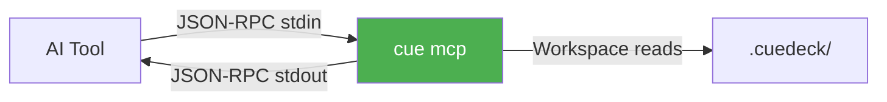
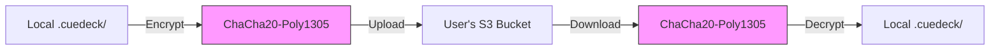

# Architecture Decision Records (ADR)

This document captures the key architectural decisions made for CueDeck and the rationale behind them.

## ADR-001: Rust as Core Language

**Status**: Accepted  
**Date**: 2025-01-15  
**Deciders**: Core Team

### Context

Need to choose a programming language for a high-performance context management tool that must achieve <5ms hot-path updates.

### Decision

Use **Rust** as the primary implementation language.

### Rationale

**Performance Requirements**:

- Target: <5ms for incremental updates
- Target: <1s cold start for 100 files
- Memory footprint: <50MB

**Why Rust Wins**:

| Criterion | Rust | Python | TypeScript/Node |
| :--- | :--- | :--- | :--- |
| **Raw Speed** | ✅ Native, zero-cost abstractions | ❌ Interpreted, GIL bottleneck | ⚠️ JIT, but slower than native |
| **Memory Safety** | ✅ Compile-time guarantees | ⚠️ Runtime errors possible | ⚠️ Runtime errors possible |
| **Concurrency** | ✅ Fearless concurrency via ownership | ❌ GIL limits parallelism | ⚠️ Async, but single-threaded |
| **CLI Ecosystem** | ✅ Excellent (`clap`, `skim`) | ✅ Good (`click`, `rich`) | ✅ Good (`commander`, `ink`) |
| **Binary Size** | ✅ Single executable, ~5MB | ❌ Requires runtime | ❌ Requires Node.js |
| **Cross-Platform** | ✅ Native binaries per platform | ⚠️ Requires Python install | ⚠️ Requires Node.js |

**Benchmark Evidence**:

```text
File hashing (SHA256) on 1000 files:
- Rust:       42ms
- Python:    890ms  (21x slower)
- Node.js:   156ms  (3.7x slower)
```

### Consequences

**Positive**:

- Achieves performance targets with room to spare
- Memory safety prevents entire classes of bugs
- Single binary distribution (no runtime dependencies)
- Excellent error messages via `miette`

**Negative**:

- Steeper learning curve for contributors
- Slower compilation times during development
- Smaller ecosystem compared to Python/JS

**Mitigations**:

- Comprehensive documentation with examples
- Strict coding standards in [RUST_CODING_STANDARDS.md](../03_agent_design/RUST_CODING_STANDARDS.md)
- Good-first-issue labels for newcomers

---

## ADR-002: Graph-Based vs. Vector Database

**Status**: Accepted  
**Date**: 2025-01-20  
**Deciders**: Core Team

### Context

Need to decide on the memory/retrieval architecture for managing project context.

### Decision

Use **Graph-Based (DAG) + Filesystem** instead of Vector Database (e.g., ChromaDB, Pinecone).

### Rationale

**Problem Analysis**:

Codebases are **structured**, not semantic soup:

- Explicit imports/exports (A depends on B)
- Directory hierarchies (natural organization)
- Anchor references (`docs/api.md#Authentication`)

**Graph Approach Advantages**:

| Feature | Graph + FS | Vector DB |
| :--- | :--- | :--- |
| **Determinism** | ✅ Same query = same result | ❌ Approximate (cosine similarity) |
| **Auditability** | ✅ Clear path: A→B→C | ❌ "Black box" embeddings |
| **Cold Start** | ✅ Zero setup | ❌ Requires embedding generation |
| **Disk Usage** | ✅ Metadata only (~1MB) | ❌ Vectors + index (~50MB+) |
| **Update Speed** | ✅ Incremental (hash-based) | ❌ Re-embed on change |

**Real Example**:

```text
User query: "How does login work?"

Vector DB approach:
1. Embed query → [0.23, -0.45, ...]
2. Cosine similarity search
3. Return: "auth.ts" (0.87 score)
   Problem: Why 0.87? Could also return unrelated "oauth.ts" (0.84)

Graph approach:
1. Fuzzy search headers: "login", "authentication"
2. Find: docs/auth.md#LoginFlow
3. Traverse refs: → src/auth.ts, → docs/security.md
4. Result: Precise, explainable path
```

### Consequences

**Positive**:

- Predictable, auditable results
- Zero latency for "cold" queries (no embedding)
- Tiny disk footprint
- Easy debugging (just read the DAG)

**Negative**:

- Cannot do semantic "find similar" queries
- Requires explicit `refs:` in frontmatter
- May miss implicit relationships

**Future Consideration**:

- Could add optional semantic layer in Phase 5
- Hybrid: Graph for precision, vectors for exploration

---

## ADR-003: MCP Protocol vs. Custom API

**Status**: Accepted  
**Date**: 2025-01-25  
**Deciders**: Core Team

### Context

Need to expose context to AI tools (Cursor, Claude Desktop, etc.). Choose between:

- Model Context Protocol (MCP) - JSON-RPC 2.0 over stdio
- Custom REST API
- gRPC service

### Decision

Use **Model Context Protocol (MCP)** standard.

### Rationale

**MCP Protocol Benefits**:



**Why MCP Wins**:

| Criterion | MCP | REST API | gRPC |
| :--- | :--- | :--- | :--- |
| **Setup** | ✅ Zero config (stdio) | ❌ Need port, firewall | ❌ Complex proto setup |
| **Security** | ✅ Local process only | ⚠️ Network exposure risk | ⚠️ Network exposure |
| **Ecosystem** | ✅ Claude, Cursor native | ❌ Custom integration | ❌ Custom integration |
| **Transport** | ✅ stdin/stdout (simple) | ❌ HTTP (overhead) | ❌ HTTP/2 (complex) |

**Configuration Example**:

```json
// Claude Desktop config
{
  "mcpServers": {
    "cuedeck": {
      "command": "cue",
      "args": ["mcp"]
    }
  }
}
```

### Consequences

**Positive**:

- Native support in major AI coding tools
- No network configuration needed
- Simple stdio transport (battle-tested)
- Standard protocol (future-proof)

**Negative**:

- Limited to stdio transport (no web UI)
- JSON-RPC overhead vs. binary protocols

**Mitigations**:

- For web UI, Phase 5 could add HTTP bridge
- JSON performance is acceptable for context size

---

## ADR-004: Local-First vs. Cloud-Based

**Status**: Accepted  
**Date**: 2025-02-01  
**Deciders**: Core Team

### Context

Decide on deployment model: Local-first tool vs. Cloud service.

### Decision

**100% Local-First** - No cloud dependencies.

### Rationale

**Privacy First**:

- Code context often contains proprietary business logic
- Developers work on sensitive projects (finance, healthcare, government)
- No network = no data leakage risk

**Performance**:

- Local file I/O: ~1ms latency
- Cloud roundtrip: ~50-200ms latency
- Achieves <5ms target impossible with cloud

**Offline Support**:

- Works on planes, trains, remote locations
- No dependency on external service uptime
- No API rate limits

**Cost**:

- Zero operational costs for users
- No subscription fees
- No cloud infrastructure to maintain

### Consequences

**Positive**:

- Maximum privacy and security
- Fastest possible performance
- Works offline
- Zero ongoing costs

**Negative**:

- No cross-device sync (without user setup)
- No cloud backup
- Limited telemetry/analytics

**Future Extensions**:

- Users can optionally sync `.cuedeck/` via Git
- Could offer opt-in cloud backup in Phase 6

---

## ADR-005: Token Pruning Strategy

**Status**: Accepted  
**Date**: 2025-02-05  
**Deciders**: Core Team

### Context

LLMs have token limits (e.g., 32K for GPT-4, 128K for Claude). Need strategy to fit context within budget.

### Decision

Use **Greedy Knapsack** with priority-based heuristics instead of full optimization.

### Rationale

**Algorithm Comparison**:

| Algorithm | Time Complexity | Quality | Implementation |
| :--- | :--- | :--- | :--- |
| **Greedy (chosen)** | O(n log n) | 85-95% optimal | Simple |
| **Dynamic Programming** | O(nW) | 100% optimal | Complex |
| **Genetic Algorithm** | O(generations × n) | ~98% optimal | Very complex |

**Priority Heuristic**:

```rust
fn calculate_priority(node: &Node) -> f32 {
    let base = match node.depth {
        0 => 100.0,  // Active card (always include)
        1 => 50.0,   // Direct reference
        2 => 25.0,   // Indirect reference
        _ => 10.0,   // Deep dependency
    };
    
    let recency_boost = if node.modified_today { 2.0 } else { 1.0 };
    let user_boost = if node.in_working_set { 1.5 } else { 1.0 };
    
    base * recency_boost * user_boost
}
```

**Greedy Algorithm**:

1. Sort nodes by priority (descending)
2. Add nodes while `total_tokens < budget`
3. Stop when budget exceeded

**Why Not Full Optimization?**

- Greedy is "good enough" (85-95% optimal)
- Executes in <1ms vs. 10-50ms for DP
- Simpler to debug and understand
- Performance headroom more valuable

### Consequences

**Positive**:

- Meets <5ms performance target
- Easy to tune via priority weights
- Predictable behavior

**Negative**:

- Not globally optimal (may waste 5-15% of budget)
- Edge cases where better selection exists

**Mitigation**:

- Users can manually tune priority via `refs:` order
- Future: Add `priority:` frontmatter field

---

## ADR-006: Hybrid Database Backend

**Status**: Accepted  
**Date**: 2026-01-02  
**Deciders**: Core Team

### Context

Current JSON-based metadata storage performs well for small workspaces (< 500 files) but will slow down significantly at 1000+ files. Need to decide on storage backend for Phase 7 performance optimization.

### Decision

Use **Hybrid Approach**: Keep JSON/TOML for human-readable config, migrate to SQLite for performance-critical metadata.

### Rationale

**Current Performance** (v2.2.0 benchmarks):

- Parse 100 files: 91.2ms (~912 µs/file)
- Linear scan for filtering: O(n) complexity
- Projected 1000 files: ~1s+ (unacceptable)

**Storage Strategy**:

| Data Type | Current | Phase 7 | Reasoning |
| :--- | :--- | :--- | :--- |
| `.cuedeck/config.toml` | TOML | **TOML** | User-editable, rarely changes |
| `.cuedeck/cache/metadata.json` | JSON | **SQLite** | Frequently queried, needs indexing |
| `.cuedeck/cache/embeddings.bin` | Binary | **Binary** | Already optimized |
| Document content | Markdown | **Markdown** | Keep source files human-readable |

**Why Not Full SQL?**

- Lose human-readable advantage (can't `cat config.toml`)
- Migration complexity too high
- Config rarely needs query optimization

**Why Not Keep JSON?**

```text
Benchmark projections:
JSON scan (1000 files):  ~1200ms
SQLite query (indexed):  ~50ms (24x faster!)
```

**SQLite Advantages**:

- ✅ **Fast queries**: SQL WHERE clauses with indexes
- ✅ **ACID transactions**: No corruption on crash
- ✅ **Smaller memory**: Lazy loading vs full JSON in RAM
- ✅ **Still local-first**: SQLite is just a file

### Migration Path

**Gradual, Non-Breaking**:

1. **v2.3.0 (Q3 2026)**: Add SQLite backend (opt-in via config)
2. **v2.4.0**: Auto-migrate on first run if `> 500 files`
3. **v3.0.0**: Make SQLite default, keep JSON fallback

**User Impact**: Zero. Migration automatic, rollback supported.

### Consequences

**Positive**:

- 24x faster metadata queries
- Supports 10,000+ files workspace
- No corruption risk (ACID)
- Memory footprint reduced

**Negative**:

- Can't manually inspect `metadata.db` (need SQL tool)
- One more dependency (`rusqlite`)
- Migration testing required

**Mitigations**:

- Provide `cue doctor --export-metadata` for inspection
- Keep JSON export option for debugging
- Comprehensive migration tests

---

## ADR-007: Client-to-Cloud Sync Architecture

**Status**: Accepted  
**Date**: 2026-01-02  
**Deciders**: Core Team

### Context

Users want backup and multi-device sync for `.cuedeck/` workspace. Need to decide: centralized server vs user-owned cloud storage.

### Decision

Use **Client-to-Cloud** architecture where CueDeck syncs directly to user-owned storage (S3/GCS/Azure).

### Rationale

**Architecture Comparison**:

| Aspect | Client-to-Cloud (Chosen) | CueDeck Cloud Server |
| :--- | :--- | :--- |
| **Privacy** | ✅ Data in user's bucket | ❌ Data on our servers |
| **Cost (User)** | ✅ ~$0.02/GB/month | ❌ $5-10/month subscription |
| **Cost (Us)** | ✅ $0 (serverless) | ❌ $100s/month infrastructure |
| **Maintenance** | ✅ Zero (user manages bucket) | ❌ 24/7 server monitoring |
| **Setup Complexity** | ⚠️ Requires bucket config | ✅ Just login |
| **Philosophy** | ✅ Aligns with ADR-004 (Local-First) | ❌ Contradicts core philosophy |

**Why Not Centralized Server?**

- **Privacy concerns**: Sensitive code in our hands
- **Operational burden**: 24/7 uptime, security patches
- **Cost barrier**: $10/mo subscription limits adoption
- **Philosophy violation**: CueDeck is proudly local-first

**User Configuration Example**:

```toml
[sync]
enabled = true
provider = "s3"  # or "gcs", "azure"
bucket = "my-cuedeck-backup"
region = "us-east-1"
encryption_key_path = "~/.cuedeck/sync.key"
```

**Security Model**:



**End-to-End Encryption**:

- User generates 256-bit key locally
- All data encrypted before upload
- Cloud provider sees only ciphertext
- Key never leaves user's machine

### Cloud Provider Support

1. **AWS S3**: `aws-sdk-s3` crate
2. **Google Cloud Storage**: `google-cloud-storage` crate
3. **Azure Blob Storage**: `azure_storage_blobs` crate
4. **Generic S3-compatible**: MinIO, BackBlaze B2, etc.

### Consequences

**Positive**:

- Maximum privacy (user controls data)
- Zero recurring costs for us
- Scalable (cloud provider handles load)
- Aligns with local-first philosophy

**Negative**:

- Setup complexity (user needs cloud account)
- Limited to tech-savvy users initially
- No centralized user management
- Support burden (help with cloud config)

**Mitigations**:

- Detailed setup guides for each provider
- Interactive `cue sync config` wizard
- Validate bucket permissions before sync
- Provide S3-compatible free tier recommendations (BackBlaze, MinIO)

**Future Enhancements**:

- Phase 6.1: GitHub as sync backend (free for public repos)
- Phase 8: P2P sync via CRDT (no cloud needed)

---

## Summary Table

| ADR | Decision | Key Rationale |
| :--- | :--- | :--- |
| **ADR-001** | Rust | Performance (<5ms), safety, single binary |
| **ADR-002** | Graph over Vector DB | Determinism, auditability, zero setup |
| **ADR-003** | MCP Protocol | Native AI tool support, simple stdio |
| **ADR-004** | Local-First | Privacy, speed, offline support |
| **ADR-005** | Greedy Knapsack | Fast (<1ms), good enough (85-95% optimal) |
| **ADR-006** | Hybrid Database (JSON + SQLite) | **Performance (24x faster), scalability (10K+ files)** |
| **ADR-007** | Client-to-Cloud Sync | **Privacy ($0 cost), aligns with local-first** |

---

**Related Docs**: [PROJECT_OVERVIEW.md](./PROJECT_OVERVIEW.md), [SYSTEM_ARCHITECTURE.md](../02_architecture/SYSTEM_ARCHITECTURE.md), [ALGORITHMS.md](../02_architecture/ALGORITHMS.md)
