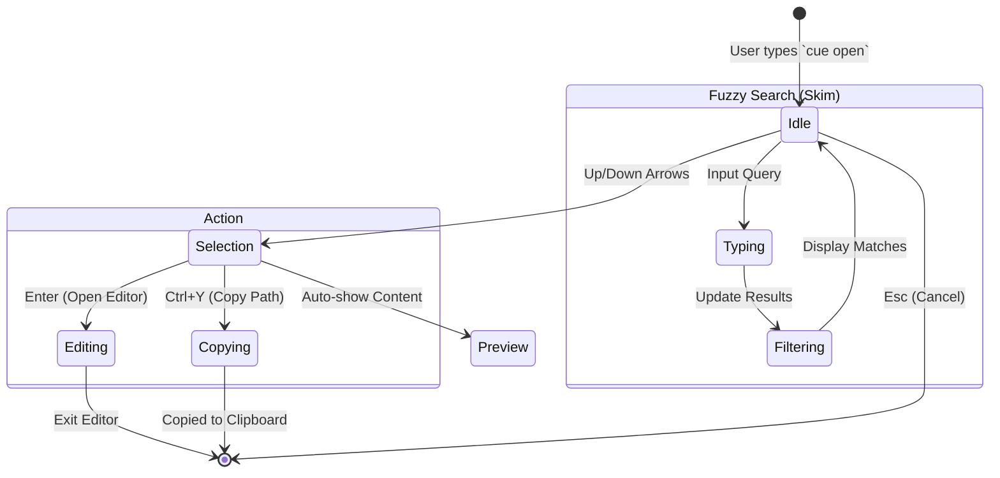
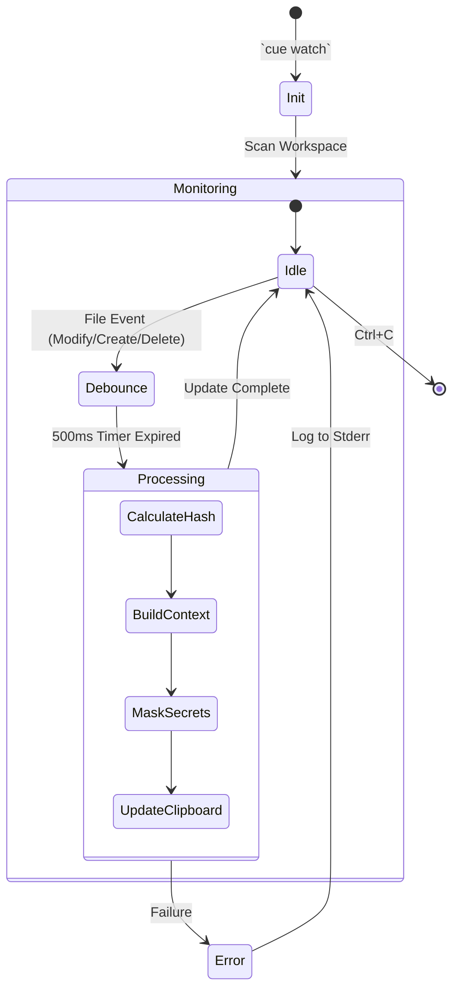
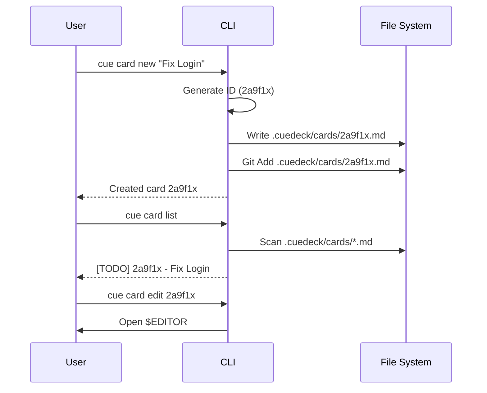

# CLI UX Flows

## 1. `cue open` (Fuzzy Finder)

**Goal**: Instant navigation.

### Flow Diagram



### Visual State (Skim)

```text
> [Query Input]        (Cursor blinking)
  12/50            (Items matched / Total)
------------------------------------------
> docs/01_general/USER_STORIES.md  (Cyan)
  crates/cue_core/src/parser.rs    (White)
  .cuedeck/cards/2a9f1x.md         (Green - Active Card)
```

### Interactions

- **Typing**: Filters list instantly.
- **Colors**:
  - **Cards**: Green (Active), Gray (Archived).
  - **Docs**: Cyan.
  - **Code**: White.
- **Enter**: Opens `$EDITOR` (VSCode/Neovim) at the file path.

## 2. `cue scene` (Context Gen)

**Goal**: Feedback on success/failure.

### Success Output (stderr)

```text
[INFO]  Workspace loaded (150ms)
[INFO]  Parsed 12 files (4 changed)
[CHECK] Token Budget: 12,450 / 32,000 (OK)
[DONE]  Scene copied to clipboard! (Size: 45KB)
```

### Warning Output

```text
[WARN]  Token limit exceeded (35,000 > 32,000).
[WARN]  Pruned 4 low-priority files from context.
```

## 3. `cue doctor` (Health Check)

**Goal**: Confidence in environment.

### Output

```text
Running CueDeck Doctor...

[OK] Workspace Root: .cuedeck/ found.
[OK] Config: Valid TOML.
[ERR] Dead Link: 'docs/auth.md' references 'docs/missing-file.md'.
[OK] Cache: Healthy (45 entries).

Result: 1 Issue Found.
```

**Exit Code**: 1

## 4. `cue watch` (Real-time Watcher)

**Goal**: Automatic context refresh on file changes.

### Watcher Loop



### Visual State (Terminal)

```text
[21:04:32] Watching .cuedeck/ for changes...
[21:04:45] Change detected: cards/2a9f1x.md
[21:04:45] Scene rebuilt in 12ms (14,200 tokens)
[21:04:45] → Clipboard updated!
[21:05:12] Change detected: docs/api.md
[21:05:12] Scene rebuilt in 8ms (14,450 tokens)
[21:05:12] → Clipboard updated!
```

### Behavior

- **Debounce**: Waits 500ms after last change before rebuilding (aggregates rapid saves).
- **Clipboard Sync**: Uses `arboard` crate to update system clipboard automatically.
- **Logs**: All output goes to `stderr` to keep terminal clean.

## 5. `cue card new` (Card Creation)

**Goal**: Quick task card creation with unique ID.

### Task Workflow



### Output (Card Creation)

```text
$ cue card new "Implement OAuth2 Login"

[INFO]  Generating Hash ID from: timestamp + "Implement OAuth2 Login"
[DONE]  Created: .cuedeck/cards/2a9f1x.md

Card Preview:
---
id: "2a9f1x"
title: "Implement OAuth2 Login"
status: "todo"
author: "your-name"       # Auto-filled from Global Config
priority: "medium"
refs: []
---
```

### Card Behavior

- **Hash ID**: 6-char alphanumeric derived from timestamp + title to avoid Git conflicts.
- **Author**: Auto-populated from `~/.config/cuedeck/config.toml` if exists.

## 6. `cue init` (Workspace Initialization)

**Goal**: Quick project setup with sensible defaults.

### Init Output

```text
$ cue init

[INFO]  Initializing CueDeck workspace...
[OK]    Created: .cuedeck/
[OK]    Created: .cuedeck/config.toml
[OK]    Created: .cuedeck/cards/
[OK]    Created: .cuedeck/docs/
[OK]    Updated: .gitignore (added .cuedeck/.cache, .cuedeck/SCENE.md)

[DONE]  Workspace ready! Run 'cue doctor' to verify setup.
```

### Idempotency

- Running `cue init` twice is safe — existing files are not overwritten.
- Use `cue init --force` to reset configuration.

## 7. `cue clean` (Cache Reset)

**Goal**: Recover from stale state.

### Output (Clean)

```text
$ cue clean

[WARN]  About to remove .cuedeck/.cache/ (Size: 45MB)
[DONE]  Cache cleared. Next run will be a Cold Start.
```

## 8. `cue upgrade` (Self-Update)

**Goal**: Seamless update to latest version.

### Output (Upgrade)

```text
$ cue upgrade

[INFO]  Checking for updates...
[INFO]  Found v2.2.0 (current: v2.1.0)
[DOWN]  Downloading binary... [====================] 100%
[DONE]  Upgraded! Restart terminal to use v2.2.0.
```

## 9. `cue mcp` (Server Mode)

**Goal**: Host JSON-RPC server for AI Agents.

### Log Output (stderr)

```text
$ cue mcp

[INFO]  CueDeck MCP Server v2.1.0 starting...
[INFO]  Transport: stdio
[INFO]  Log Level: INFO (writing to stderr)
[INFO]  Server ready. Listening for JSON-RPC messages...
```

> **Note**: `stdout` remains silent to allow JSON-RPC traffic.

---
**Related Docs**: [CLI_REFERENCE.md](../04_tools_and_data/CLI_REFERENCE.md), [USER_STORIES.md](./USER_STORIES.md)
