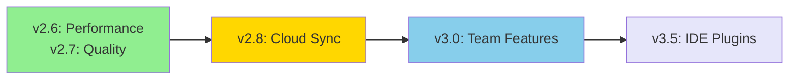

# Product Specification

**CueDeck**: Local-first, AI-friendly knowledge graph for developers

---

## Who Uses CueDeck?

### Primary Persona: Solo Developer

**Profile**:

- Indie hackers, freelancers, startup engineers
- Works solo or in small teams (2-5 people)
- Manages 5-20 projects simultaneously
- Uses AI assistants (Claude, Cursor, Copilot) daily

**Pain Point**:

- Context switching kills productivity
- AI assistants ask repetitive questions ("What's the folder structure?")
- Hard to remember project decisions made weeks ago
- Generic RAG tools miss project-specific patterns

**Goal**:

- Keep entire codebase in "working memory"
- Zero-setup context for AI tools
- Fast access to project knowledge

**Success Metric**:

- **30% less time** finding relevant code
- **50% fewer** AI follow-up questions
- **10x faster** onboarding on old projects

---

### Secondary Persona: AI Agent

**Profile**:

- Claude Desktop with MCP integration
- Cursor IDE with context awareness
- GitHub Copilot with workspace knowledge
- Custom automation scripts

**Pain Point**:

- Generic embeddings miss domain-specific relationships
- No access to "why" behind architectural decisions
- Cannot traverse dependency graphs efficiently
- Token limits force lossy compression

**Goal**:

- Precision context retrieval (not brute-force RAG)
- Understand project structure semantically
- Access task dependencies and history

**Success Metric**:

- **90%+ relevance** in top-5 search results
- **80% reduction** in irrelevant context
- **<200ms** query latency for 1000+ files

---

## User Journeys

### Journey 1: First-Time Setup (5 minutes)

**Actor**: New user (developer discovering CueDeck)

**Steps**:

1. **Install**

   ```bash
   cargo install cuedeck
   ```

   *Expected time: 2 min (includes compilation)*

2. **Initialize** workspace

   ```bash
   cd ~/my-project
   cue init
   ```

   *Creates `.cuedeck/` directory with config*

3. **First scene generation**

   ```bash
   cue scene
   ```

   *Output: SCENE.md copied to clipboard*

4. **Paste to AI**
   - Open Claude Desktop
   - Paste clipboard content
   - Agent immediately understands project structure

**Success**: User sees AI give project-specific answers without asking clarifying questions

**Failure Points**:

- Rust not installed → Clear error message with install link
- Not in Git repo → Warning + continue anyway
- Empty project → Scene shows "New project detected, start creating tasks"

---

### Journey 2: Daily Workflow (30 seconds)

**Actor**: Existing user working on a feature

**Steps**:

1. **Task switch**
   - User opens task card: `tasks/auth/jwt-refresh.md`
   - Task has dependencies via `depends_on:` frontmatter

2. **Auto scene** (with watcher)

   ```bash
   cue watch &
   ```

   *Watcher updates scene on file save*

3. **Query context**
   - User asks Claude: "How do I test JWT refresh?"
   - Agent reads updated SCENE.md (via MCP or clipboard)
   - Provides relevant code references + test examples

4. **Code + commit**
   - User writes code, saves file
   - Watcher updates scene immediately
   - Next AI query has fresh context

**Success**: Zero manual context updates, AI always has current state

**Failure Points**:

- Watcher crashes → Auto-restart with exponential backoff
- Scene becomes stale → Timestamp shows age, manual refresh suggested

---

### Journey 3: MCP Integration (One-time, 2 minutes)

**Actor**: User wanting deeper AI integration

**Steps**:

1. **Add to Claude Desktop config**

   ```json
   {
     "mcpServers": {
       "cuedeck": {
         "command": "cue",
         "args": ["mcp"]
       }
     }
   }
   ```

2. **Restart Claude Desktop**

3. **Ask contextual questions**
   - "What's in my auth module?"
   - "Show me task dependencies for user-login"
   - "Search for error handling patterns"

4. **Agent reads directly** via MCP tools:
   - `read_context` → Fuzzy search
   - `read_doc` → Specific file/section
   - `list_tasks` → Filtered by status

**Success**: Agent can explore codebase independently, no copy-paste needed

**Failure Points**:

- MCP server not found → Claude shows clear error with setup instructions
- Permission denied → Check file permissions on `.cuedeck/` directory

---

## User Session Patterns

| Session Type       | Duration   | Frequency | Context Size | Tools Used          |
|:-------------------|:-----------|:----------|:-------------|:--------------------|
| Quick Bug Fix      | 15-30 min  | Daily     | 2-5 files    | `cue scene`, grep   |
| Feature Development| 2-4 hours  | 3x/week   | 10-20 files  | `cue search`, watch |
| Code Review        | 30-60 min  | 2x/week   | 5-15 files   | `cue graph`, scene  |
| Deep Refactor      | 1-2 days   | Weekly    | 20-50 files  | MCP integration     |

**Insight**: Most sessions are <1 hour → Speed matters more than completeness

---

## Non-Goals (Critical!)

> [!CAUTION] **What CueDeck Is NOT**
>
> These are **intentional limitations** to keep scope focused.

### ❌ NOT a project management tool

- **Why**: Jira/Linear/GitHub Projects do this well
- **Instead**: CueDeck focuses on *knowledge*, not *workflow*
- **Example**: We store task metadata, but no sprints/milestones/burndown charts

### ❌ NOT a collaborative editor

- **Why**: VS Code Live Share solves this
- **Instead**: Local-first, single-user optimized
- **Future**: P2P sync (Phase 8), but no real-time editing

### ❌ NOT for non-technical users

- **Why**: Requires markdown fluency + CLI comfort
- **Instead**: Built for developers who live in the terminal
- **Example**: No GUI, no drag-drop, no WYSIWYG

### ❌ NOT a replacement for documentation

- **Why**: Complements docs, doesn't replace
- **Instead**: CueDeck is the *index* to your docs
- **Example**: `tasks/architecture/database.md` links to full `docs/DATABASE.md`

### ❌ NOT a code generation platform

- **Why**: AI assistants handle generation
- **Instead**: CueDeck provides *context*, agent generates code
- **Example**: We don't have templates/scaffolding (use `cargo init`, `npx create-*`)

---

## Success Criteria

### Adoption Metrics (12 months)

| Metric              | Target    | Measurement      |
|:--------------------|:----------|:-----------------|
| Active users        | 1,000     | Telemetry opt-in |
| MCP integrations    | 500       | Config checks    |
| Retention (weekly)  | 60%       | Weekly active    |
| GitHub stars        | 2,000     | Public repo      |

### Performance Metrics (v2.7+)

| Metric              | Target    | Baseline (v2.6)  |
|:--------------------|:----------|:-----------------|
| Context generation  | <1s       | 1.2s (100 files) |
| Search latency (p95)| <200ms    | 350ms            |
| Memory footprint    | <100MB    | 80MB (1000 files)|
| Startup time        | <50ms     | 35ms             |

### Quality Metrics (User-reported)

| Metric            | Target         | Method                         |
|:------------------|:---------------|:-------------------------------|
| AI relevance      | 80%            | Survey: "Was context helpful?" |
| Search precision  | 90%            | Top-5 includes target          |
| Stability         | <1 bug/1000h   | GitHub issues                  |
| Docs completeness | 95%            | All features documented        |

---

## Product Roadmap Alignment



**Current Focus**: Local-first, developer-centric, AI-friendly

### Version Details

**v2.7 (This release)**:

- Quality & Governance improvements
- Security rules for agentic development
- Engineering standards enforcement

**v2.8 (Q2 2026)**:

- Optional cloud backup
- Cross-device sync (same user)
- End-to-end encryption

**v3.0 (Q3 2026)**:

- Team features (shared knowledge base)
- Conflict resolution (CRDT-based)
- Role-based access

**v3.5 (Q4 2026)**:

- VSCode extension
- JetBrains plugin
- Vim/Neovim integration

---

## Design Principles

### 1. Local-First

- **Rationale**: Privacy, speed, offline work
- **Trade-off**: No built-in collaboration (yet)
- **Example**: All data in `.cuedeck/`, no cloud required

### 2. Zero Configuration

- **Rationale**: Developers hate setup
- **Trade-off**: Fewer customization options
- **Example**: `cue init` creates opinionated defaults

### 3. Markdown Native

- **Rationale**: Git-friendly, human-readable, tool-agnostic
- **Trade-off**: No rich media (images, embeds)
- **Example**: Tasks are `.md` files, not JSON

### 4. AI-First API

- **Rationale**: Optimize for LLM consumption, not human UI
- **Trade-off**: CLI output may be verbose
- **Example**: SCENE.md optimized for token efficiency, not beauty

### 5. Unix Philosophy

- **Rationale**: Do one thing well, compose with others
- **Trade-off**: Not an all-in-one solution
- **Example**: `cue scene | pbcopy` composes with clipboard

---

## Competitive Positioning

| Product       | Strength                 | CueDeck Advantage                      |
|:--------------|:-------------------------|:---------------------------------------|
| Obsidian      | Rich UI, plugins         | **CLI-first, AI-native**               |
| Notion        | Collaboration, databases | **Local-first, markdown**              |
| Roam Research | Bi-directional links     | **Git-friendly, developer UX**         |
| Logseq        | Outliner, queries        | **MCP integration, scene generation**  |

**Unique Value**: CueDeck is the only tool designed *specifically* for AI-assisted development workflows.

---

## Related Docs

- [PROJECT_OVERVIEW.md](./PROJECT_OVERVIEW.md) - High-level vision
- [USER_STORIES.md](./USER_STORIES.md) - Detailed user scenarios
- [ROADMAP.md](./ROADMAP.md) - Version timeline
- [ARCHITECTURE_DECISIONS.md](./ARCHITECTURE_DECISIONS.md) - Why Rust, why local-first
