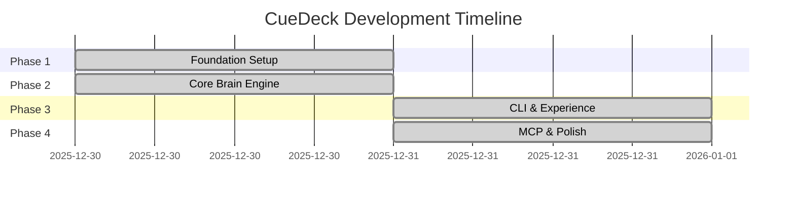

# Project Roadmap

> [!NOTE]
> **v2.1.0 Release** (2025-12-31): Phases 1-4 are **COMPLETED**. All features fully implemented and tested.

## Timeline Overview

## Progress Legend

| Status | Icon | Meaning |
| :--- | :--- | :--- |
| **Not Started** | ⬜ | Work not begun |
| **In Progress** | 🔄 | Currently under development |
| **Completed** | ✅ | Done and tested |
| **Blocked** | 🚫 | Waiting on dependency |

---

## Phase 1: Foundation ✅

**Theme**: Workspace Setup & Configuration Infrastructure  
**Status**: ✅ **Completed** (2025-12-31)

| Task | Owner | Status | Notes |
| :--- | :--- | :--- | :--- |
| Initialize workspace with 5 crates | - | ✅ | `cue_common`, `cue_config`, `cue_core`, `cue_cli`, `cue_mcp` |
| Implement config engine | - | ✅ | Cascading: global → project → CLI |
| Define core types | - | ✅ | `CueError`, `Document`, `Card`, `Anchor` |
| Implement file I/O helpers | - | ✅ | SHA256 hashing, safe file reading |

> [!CHECK] **Phase 1 Exit Criteria** ✅
>
> - ✅ `cargo build` passes for all 5 crates
> - ✅ `cargo test` passes for `cue_config` and `cue_common`
> - ✅ `cue --help` runs successfully

---

## Phase 2: The Core Brain ✅

**Theme**: Intelligent Data Processing  
**Status**: ✅ **Completed** (2025-12-31)

| Task | Owner | Status | Notes |
| :--- | :--- | :--- | :--- |
| **Caching System** | - | ✅ | - |
| └─ CacheManager implementation | - | ✅ | Load/save `metadata.json` |
| └─ Lazy GC logic | - | ✅ | Invalidate on miss |
| **Parser Engine** | - | ✅ | - |
| └─ Markdown AST parsing | - | ✅ | `pulldown-cmark` |
| └─ Frontmatter extraction | - | ✅ | `gray_matter` |
| └─ Anchor extraction | - | ✅ | Header-based segmentation |
| **Graph Theory** | - | ✅ | - |
| └─ DependencyGraph | - | ✅ | Resolve `@ref` links |
| └─ Cycle detection | - | ✅ | DFS algorithm |

> [!CHECK] **Phase 2 Exit Criteria** ✅
>
> - ✅ Cache invalidation works correctly
> - ✅ Parser extracts anchors from any Markdown file
> - ✅ Cycle detection catches A→B→A patterns

---

## Phase 3: CLI & Experience ✅

**Theme**: Human Interaction  
**Status**: ✅ **Completed** (2025-12-31)

| Task | Owner | Status | Notes |
| :--- | :--- | :--- | :--- |
| Interactive UI (`cue open`) | - | ✅ | `skim` fuzzy finder |
| Scene Builder | - | ✅ | Graph + Cache → SCENE.md |
| File Watcher (`cue watch`) | - | ✅ | `notify` + debounce + clipboard |
| CLI commands finalization | - | ✅ | `init`, `card`, `doctor`, `clean` |

> [!CHECK] **Phase 3 Exit Criteria** ✅
>
> - ✅ `cue open` launches TUI and selects files
> - ✅ `cue scene` generates valid SCENE.md
> - ✅ `cue watch` updates clipboard within 500ms of file save

---

## Phase 4: MCP & Polish ✅

**Theme**: AI Integration & Distribution  
**Status**: ✅ **Completed** (2025-12-31)

| Task | Owner | Status | Notes |
| :--- | :--- | :--- | :--- |
| **MCP Server** | - | ✅ | - |
| └─ JSON-RPC loop | - | ✅ | stdin/stdout |
| └─ stderr log routing | - | ✅ | **Critical**: No stdout pollution |
| **Tools** | - | ✅ | - |
| └─ `read_context` | - | ✅ | Fuzzy search |
| └─ `read_doc` | - | ✅ | Granular read |
| └─ `list_tasks` | - | ✅ | Task listing |
| └─ `update_task` | - | ✅ | Task modification |
| **Security** | - | ✅ | Regex secret masking |
| **Self-Update** | - | ✅ | `cue upgrade` |
| **CI/CD** | - | ✅ | GitHub Actions + cargo-binstall |

> [!CHECK] **Phase 4 Exit Criteria** ✅
>
> - ✅ MCP server works with Claude Desktop
> - ✅ All 4 tools function correctly
> - ✅ Binaries published for Linux/macOS/Windows
> - ✅ `cue upgrade` downloads and installs new versions

---

## Future Phases (Post-v2.1.0)

| Phase | Theme | Key Features | Status |
| :--- | :--- | :--- | :--- |
| **5** | Semantic Enhancement | Optional vector search layer | ✅ Completed (v2.2.0) |
| **6** | Cloud Sync | Optional `.cuedeck/` backup to cloud | ⬜ Future |
| **7** | IDE Plugins | VSCode/JetBrains integrations | ⬜ Future |
| **8** | Team Features | Multi-user card assignments | ⬜ Future |

---

## Risk Register

| Risk | Impact | Mitigation |
| :--- | :--- | :--- |
| MCP protocol changes | High | Pin to MCP spec v1.0 |
| Performance regression | Medium | Benchmark CI on every PR |
| Secret leakage | Critical | Mandatory regex guard + tests |
| Cross-platform issues | Medium | Test on all 3 OS in CI |

---
**Related Docs**: [PROJECT_STRUCTURE.md](../03_agent_design/PROJECT_STRUCTURE.md), [MODULE_DESIGN.md](../02_architecture/MODULE_DESIGN.md), [TESTING_STRATEGY.md](../05_quality_and_ops/TESTING_STRATEGY.md), [RISK_MANAGEMENT.md](../05_quality_and_ops/RISK_MANAGEMENT.md)
