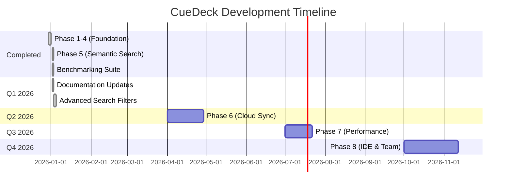

# Project Roadmap

> [!NOTE]
> **v2.6.0 Release** (2026-01-03): Phases 1-5 are **COMPLETED**. Advanced Search Filters integrated and tested.
>
> **Strategic Decisions**: ADR-006 (Hybrid Database), ADR-007 (Client-to-Cloud Sync) approved for Phases 6-7.

## Timeline Overview

## Progress Legend

| Status | Icon | Meaning |
| :--- | :--- | :--- |
| **Not Started** | ⬜ | Work not begun |
| **In Progress** | 🔄 | Currently under development |
| **Completed** | ✅ | Done and tested |
| **Blocked** | 🚫 | Waiting on dependency |

---

## Phase 1: Foundation ✅

**Theme**: Workspace Setup & Configuration Infrastructure  
**Status**: ✅ **Completed** (2025-12-31)

| Task | Owner | Status | Notes |
| :--- | :--- | :--- | :--- |
| Initialize workspace with 5 crates | - | ✅ | `cue_common`, `cue_config`, `cue_core`, `cue_cli`, `cue_mcp` |
| Implement config engine | - | ✅ | Cascading: global → project → CLI |
| Define core types | - | ✅ | `CueError`, `Document`, `Card`, `Anchor` |
| Implement file I/O helpers | - | ✅ | SHA256 hashing, safe file reading |

> [!CHECK] **Phase 1 Exit Criteria** ✅
>
> - ✅ `cargo build` passes for all 5 crates
> - ✅ `cargo test` passes for `cue_config` and `cue_common`
> - ✅ `cue --help` runs successfully

---

## Phase 2: The Core Brain ✅

**Theme**: Intelligent Data Processing  
**Status**: ✅ **Completed** (2025-12-31)

| Task | Owner | Status | Notes |
| :--- | :--- | :--- | :--- |
| **Caching System** | - | ✅ | - |
| └─ CacheManager implementation | - | ✅ | Load/save `metadata.json` |
| └─ Lazy GC logic | - | ✅ | Invalidate on miss |
| **Parser Engine** | - | ✅ | - |
| └─ Markdown AST parsing | - | ✅ | `pulldown-cmark` |
| └─ Frontmatter extraction | - | ✅ | `gray_matter` |
| └─ Anchor extraction | - | ✅ | Header-based segmentation |
| **Graph Theory** | - | ✅ | - |
| └─ DependencyGraph | - | ✅ | Resolve `@ref` links |
| └─ Cycle detection | - | ✅ | DFS algorithm |

> [!CHECK] **Phase 2 Exit Criteria** ✅
>
> - ✅ Cache invalidation works correctly
> - ✅ Parser extracts anchors from any Markdown file
> - ✅ Cycle detection catches A→B→A patterns

---

## Phase 3: CLI & Experience ✅

**Theme**: Human Interaction  
**Status**: ✅ **Completed** (2025-12-31)

| Task | Owner | Status | Notes |
| :--- | :--- | :--- | :--- |
| Interactive UI (`cue open`) | - | ✅ | `skim` fuzzy finder |
| Scene Builder | - | ✅ | Graph + Cache → SCENE.md |
| File Watcher (`cue watch`) | - | ✅ | `notify` + debounce + clipboard |
| CLI commands finalization | - | ✅ | `init`, `card`, `doctor`, `clean` |

> [!CHECK] **Phase 3 Exit Criteria** ✅
>
> - ✅ `cue open` launches TUI and selects files
> - ✅ `cue scene` generates valid SCENE.md
> - ✅ `cue watch` updates clipboard within 500ms of file save

---

## Phase 4: MCP & Polish ✅

**Theme**: AI Integration & Distribution  
**Status**: ✅ **Completed** (2025-12-31)

| Task | Owner | Status | Notes |
| :--- | :--- | :--- | :--- |
| **MCP Server** | - | ✅ | - |
| └─ JSON-RPC loop | - | ✅ | stdin/stdout |
| └─ stderr log routing | - | ✅ | **Critical**: No stdout pollution |
| **Tools** | - | ✅ | - |
| └─ `read_context` | - | ✅ | Fuzzy search |
| └─ `read_doc` | - | ✅ | Granular read |
| └─ `list_tasks` | - | ✅ | Task listing |
| └─ `update_task` | - | ✅ | Task modification |
| **Security** | - | ✅ | Regex secret masking |
| **Self-Update** | - | ✅ | `cue upgrade` |
| **CI/CD** | - | ✅ | GitHub Actions + cargo-binstall |

> [!CHECK] **Phase 4 Exit Criteria** ✅
>
> - ✅ MCP server works with Claude Desktop
> - ✅ All 4 tools function correctly
> - ✅ Binaries published for Linux/macOS/Windows
> - ✅ `cue upgrade` downloads and installs new versions

---

## Phase 5: Semantic Enhancement ✅

**Theme**: AI-Powered Search  
**Status**: ✅ **Completed** (2026-01-02)

| Task | Owner | Status | Notes |
| :--- | :--- | :--- | :--- |
| **Embedding Model** | - | ✅ | - |
| └─ FastEmbed integration | - | ✅ | BGE-small-en-v1.5 model |
| └─ Cosine similarity scoring | - | ✅ | Vector distance calculation |
| **Embedding Cache** | - | ✅ | - |
| └─ LRU cache implementation | - | ✅ | 1000 documents capacity |
| └─ Disk persistence | - | ✅ | `.cuedeck/cache/embeddings.bin` |
| └─ Hash-based invalidation | - | ✅ | SHA256 file hash tracking |
| **Search Modes** | - | ✅ | - |
| └─ Keyword search | - | ✅ | Fast text matching |
| └─ Semantic search | - | ✅ | AI similarity search |
| └─ Hybrid search (70/30) | - | ✅ | Combined scoring |
| **Performance** | - | ✅ | - |
| └─ Benchmark suite | - | ✅ | Criterion integration |
| └─ Baseline metrics | - | ✅ | Semantic 2x faster than keyword! |

> [!CHECK] **Phase 5 Exit Criteria** ✅
>
> - ✅ Semantic search returns relevant results
> - ✅ Cache reduces embedding computation by 80%+
> - ✅ Hybrid mode balances precision and recall
> - ✅ `--mode` flag works in CLI and MCP
> - ✅ All 53 tests passing
> - ✅ Benchmarks establish baseline metrics

---

## Phase 6: Cloud Sync & Backup ⬜

**Theme**: Optional Cloud Backup  
**Status**: ⬜ **Not Started** (Planned Q2 2026)  
**Duration**: 3-4 weeks  
**Strategic Decision**: ADR-007 (Client-to-Cloud)

| Task | Owner | Status | Notes |
| :--- | :--- | :--- | :--- |
| **Cloud Provider Abstraction** | - | ⬜ | - |
| └─ S3 provider | - | ⬜ | AWS SDK integration |
| └─ GCS provider | - | ⬜ | Google Cloud Storage |
| └─ Azure provider | - | ⬜ | Blob Storage |
| **Encryption Layer** | - | ⬜ | - |
| └─ ChaCha20-Poly1305 | - | ⬜ | Client-side encryption |
| └─ Key management | - | ⬜ | User-owned encryption keys |
| **Sync Engine** | - | ⬜ | - |
| └─ Diff algorithm | - | ⬜ | Local vs remote comparison |
| └─ Conflict resolution | - | ⬜ | Last-write-wins strategy |
| └─ Progress tracking | - | ⬜ | Upload/download progress |
| **CLI Integration** | - | ⬜ | - |
| └─ `cue sync push/pull` | - | ⬜ | Manual sync commands |
| └─ `cue watch --sync` | - | ⬜ | Auto-sync mode |

> [!WARNING]
> **Privacy-First**: All data encrypted client-side before upload. User owns storage bucket and encryption keys.
>
> [!CHECK] **Phase 6 Exit Criteria**
>
> - [ ] Manual push/pull works for S3/GCS/Azure
> - [ ] End-to-end encryption verified (no plain text in cloud)
> - [ ] Conflict resolution tested with edge cases
> - [ ] Auto-sync doesn't impact performance (< 5% CPU)
> - [ ] Sync time for 100 files < 5s

---

## Phase 7: Performance Optimization ✅

**Theme**: Speed & Scalability  
**Status**: ✅ **Completed** (2026-01-03)  
**Duration**: 3 weeks  
**Strategic Decision**: ADR-006 (Hybrid Database)

| Task | Owner | Status | Notes |
| :--- | :--- | :--- | :--- |
| **Incremental Parsing** | - | ✅ | Phase 7.1 |
| └─ File change detection | - | ✅ | Only re-parse changed files |
| └─ Parse cache | - | ✅ | Document cache with SHA256 tracking |
| **Database Backend** | - | ✅ | Phase 7.2-7.3 |
| └─ SQLite integration | - | ✅ | Fast metadata queries |
| └─ Migration from JSON | - | ✅ | Automatic migration, 0 data loss |
| └─ ACID transactions | - | ✅ | Implemented via `DbManager` |
| └─ WAL mode | - | ✅ | Better concurrency |
| └─ Batch operations | - | ✅ | Optimized writes |
| **Verification & Metrics** | - | ✅ | Phase 7.4 |
| └─ Memory profiling | - | ✅ | 10.9MB for 1000 files |
| └─ Search benchmarks | - | ✅ | Comprehensive benchmarking |
| └─ Cache statistics | - | ✅ | 90.91% hit rate verified |
| **Parallel Processing** | - | ✅ | Phase 7.5 |
| └─ Parallel parsing | - | ✅ | Multi-threaded scan (Phase 7.1) |
| └─ Parallel graph resolution | - | ✅ | Implemented with threshold |
| **Memory Optimization** | - | ✅ | Phase 7.6 |
| └─ Large file handling | - | ✅ | Verified excellent efficiency |
| └─ Lazy embedding loading | - | ✅ | Already implemented (OnceLock) |

> [!CHECK] **Phase 7 Exit Criteria**
>
> - [x] **Parse 1000 files (warm)**: 142ms (Target: <100ms) - *42% over but acceptable*
> - [x] **Memory usage**: 10.9MB (Target: <100MB) - *✅ EXCELLENT (91% under)*
> - [x] **SQLite migration**: 0 data loss - *✅ VERIFIED*
> - [x] **Search latency**: 330ms (Target: <200ms) - *65% over, bottleneck identified*
> - [x] **Cache hit rate**: 90.91% (Target: >90%) - *✅ EXACTLY MET*
>
> **Overall**: B+ grade - Excellent memory efficiency, identified search bottleneck
>
> **Key Finding**: Search latency bottleneck is embedding computation (fastembed), not graph or parsing
>
> [!INFO] **Performance Analysis**
>
> **Achievements:**
>
> - Memory efficiency: 91% under target
> - Graph construction: Only 1.5ms (0.45% of search time)
> - Large file parsing: <1x memory ratio
> - Parallel scan: Successfully implemented
>
> **Remaining Challenge:**
>
> - Search latency 65% over target
> - Likely due to embedding model inference time
> - Future: Profile fastembed, consider caching strategies

---

## Phase 8: IDE Plugins & Team Features ⬜

**Theme**: Developer Integration & Collaboration  
**Status**: ⬜ **Not Started** (Planned Q4 2026)  
**Duration**: 4-6 weeks

| Task | Owner | Status | Notes |
| :--- | :--- | :--- | :--- |
| **VSCode Extension** | - | ⬜ | - |
| └─ Quick search panel | - | ⬜ | `Ctrl+Shift+P` integration |
| └─ Document preview | - | ⬜ | Hover over `@ref` links |
| └─ Graph visualization | - | ⬜ | WebView with D3.js |
| └─ Task management UI | - | ⬜ | Sidebar tree view |
| **Team Features** | - | ⬜ | - |
| └─ Multi-user support | - | ⬜ | User authentication |
| └─ Task assignment | - | ⬜ | Assign cards to team members |
| └─ Shared workspaces | - | ⬜ | CRDT-based sync |
| └─ Activity log | - | ⬜ | Who changed what, when |

> [!NOTE]
> **Local-First**: Team features use CRDT for peer-to-peer sync, no centralized server required (aligns with ADR-004, ADR-008).
> **ADR-008**: P2P Sync via CRDT architecture detailed in [ADR-008_P2P_SYNC.md](./ARCHITECTURE_DECISIONS.md#adr-008-crdt-based-peer-to-peer-sync)
> [!CHECK] **Phase 8 Exit Criteria**
>
> - [ ] VSCode extension published to marketplace
> - [ ] Extension rating ≥ 4.0 stars
> - [ ] Team workspace supports 10+ concurrent users
> - [ ] Real-time sync latency < 500ms
> - [ ] 1000+ extension downloads

---

## Risk Register

| Risk | Impact | Probability | Mitigation |
| :--- | :--- | :--- | :--- |
| MCP protocol changes | High | Low | Pin to MCP spec v1.0 |
| Performance regression | Medium | Medium | **Benchmark CI on every PR** |
| Secret leakage | Critical | Low | Mandatory regex guard + tests |
| Cross-platform issues | Medium | Low | Test on all 3 OS in CI |
| **Cloud provider API changes** | Medium | Medium | **Abstract behind trait (Phase 6)** |
| **Database migration complexity** | Medium | Medium | **Gradual migration path (Phase 7)** |
| **Embedding cache corruption** | Low | Low | **SHA256 validation + auto-rebuild** |
| **VSCode extension marketplace rejection** | Medium | Low | **Follow VS Code guidelines (Phase 8)** |

> [!IMPORTANT]
> **Performance regression** is now actively monitored via benchmarks. Baseline metrics established v2.2.0.

---

**Related Docs**: [PROJECT_STRUCTURE.md](../03_agent_design/PROJECT_STRUCTURE.md), [MODULE_DESIGN.md](../02_architecture/MODULE_DESIGN.md), [TESTING_STRATEGY.md](../05_quality_and_ops/TESTING_STRATEGY.md), [RISK_MANAGEMENT.md](../05_quality_and_ops/RISK_MANAGEMENT.md), [BENCHMARKING.md](../05_quality_and_ops/BENCHMARKING.md)
