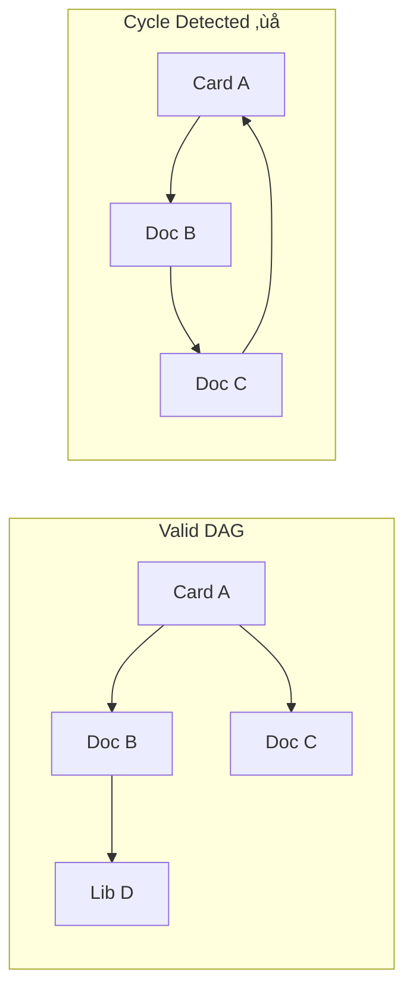
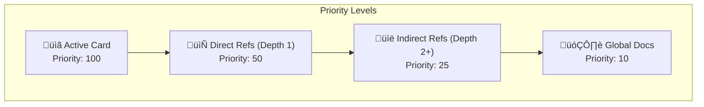

# Algorithm Specifications

## Overview

This document specifies the core algorithms powering CueDeck's context management.


## 1. Context Resolution DAG (Directed Acyclic Graph)

The core of CueDeck is the ability to interpret a list of files as a coherent "Scene".

### 1.1 Cycle Detection (DFS)

We use a standard Depth-First Search with a `recursion_stack` to detect cycles.

**Time Complexity**: O(V + E) where V = files, E = references  
**Space Complexity**: O(V) for visited/stack sets



```rust
fn has_cycle(node, visited, stack) -> bool {
    visited.add(node);
    stack.add(node);
    
    for child in graph.get(node) {
        if !visited.contains(child) {
             if has_cycle(child, visited, stack) return true;
        } else if stack.contains(child) {
             return true; // CYCLE DETECTED
        }
    }
    stack.remove(node);
    return false;
}
```

**Policy**: If a cycle is detected, the `cue scene` command FAILS immediately with Error `1002`, listing the cycle path (`A -> B -> A`).

### 1.2 Topological Sort (Linearization)

Once verified acyclic, we flatten the graph to produce the `SCENE.md` order.

**Algorithm**: Modified Kahn's algorithm with priority weighting



- **Priority**:
    1. Active Card (Root) - Always included first
    2. Direct Children (Depth 1) - High priority
    3. Indirect Children (Depth 2+) - Medium priority
    4. Sibling/Global Docs (if space permits) - Low priority

## 2. Token Pruning (The "Knapsack-Lite")

We do not solve the full Knapsack problem; we use a Greedy approach.

- **Budget**: `N` tokens (default 32k).
- **Algorithm**:
    1. Start with `Empty Buffer`.
    2. Add **Active Card** (Critical). Update `UsedTokens`.
    3. Iterate through **Topological Sorted List**:
        - `Estimate` token count of Node `i`.
        - If `UsedTokens + Estimate(i) < N`:
            - Append Node `i` content.
            - `UsedTokens += Estimate(i)`.
        - Else:
            - Append `> [!WARNING] Context Truncated here...`
            - Break.

## 3. Anchor Extraction

How we identify specific sections: `@doc/api#Login`.

1. **Parse**: `pulldown-cmark` event stream.
2. **State Machine**:
    - `Scanning`: Looking for Header Event with text matching "Login".
    - `Capturing`: Found Header. Record events.
        - **Depth Check**: Store current header level (e.g., H2).
    - `Stopping`:
        - Next Event is Header <= Saved Level (H1 or H2).
        - Or End-of-File.

## 4. Security Guard

Runs as a final filter on the Output Buffer. See [SECURITY.md](./SECURITY.md) for implementation details.

## 5. Token Optimization Strategies (Extended)
>
> **Detailed Patterns**: See [`IMPLEMENTATION_PATTERNS.md`](./IMPLEMENTATION_PATTERNS.md)

### Strategy 1: Semantic Compression

```text
Before (850 tokens):
```typescript
export async function fetchUserData(userId: string): Promise<User> {
  try {
    const response = await fetch(`/api/users/${userId}`);
    if (!response.ok) {
      throw new Error(`HTTP error! status: ${response.status}`);
    }
    const data = await response.json();
    return data as User;
  } catch (error) {
    console.error('Failed to fetch user:', error);
    throw error;
  }
}
```

After (180 tokens):

```text
fn fetchUserData(id: string) -> Promise<User>
  - Fetches from /api/users/{id}
  - Returns User | throws Error
  - See file:complete for impl
```

### Strategy 2: Delta Diffing

```text
Session state:
- File state at start: src/api.ts [hash: abc123]
- Agent changed lines 10-15, 42, 88
- Next agent needs delta, not full file:

Delta format:
src/api.ts:
  L10-15: [new content]
  L42: [new line]
  L88: [modified line]
  [Other 200 lines unchanged - reference as "..."]
```

### Strategy 3: File Importance Scoring

```text
Score = (references * 0.3) + (recent_changes * 0.35) + (in_error_stack * 0.35)

Example ranking for "Add auth to API":
1. src/api.ts (referenced 45 times) - MUST INCLUDE
2. src/auth.ts (changed yesterday) - MUST INCLUDE
3. src/types.ts (imported by api.ts) - INCLUDE IF SPACE
4. src/utils.ts (not related) - SKIP
5. docs/api.md (helpful but not critical) - SKIP
```

### Strategy 4: Smart Caching

```text
Cache levels (in memory, ~50MB max):
L1: Current role + active workflow (always hot)
L2: Last 3 files accessed (1-2s reload)
L3: Project metadata (instant)
L4: Rules & architecture (instant)

Eviction: LRU after 30 min inactivity
```

## 6. Algorithm Complexity Analysis

Comprehensive performance characteristics of all core algorithms:

| Algorithm | Time Complexity | Space Complexity | Worst Case | Optimization Notes |
| :--- | :--- | :--- | :--- | :--- |
| **Cycle Detection (DFS)** | O(V + E) | O(V) | O(V²) sparse graph | Early termination on first cycle |
| **Topological Sort** | O(V + E) | O(V) | O(V + E) | Kahn's algorithm with priority queue |
| **Token Pruning (Greedy)** | O(N) | O(1) | O(N) | Single pass, no backtracking |
| **Anchor Extraction** | O(M) | O(M) | O(M) | M = markdown events, linear scan |
| **Secret Masking (Regex)** | O(P × L) | O(L) | O(P × L²) | P = patterns, L = content length |
| **Hash Computation (SHA-256)** | O(N) | O(1) | O(N) | Streaming for large files |
| **File Importance Scoring** | O(F) | O(F) | O(F) | F = file count, cached scores |

**Legend**:

- V = Vertices (files/nodes)
- E = Edges (references)
- N = Total tokens
- M = Markdown events
- P = Security patterns
- L = Content length
- F = File count

### Real-World Performance Benchmarks

Based on typical CueDeck workspace (500 files, 50 active cards):

| Operation | Target | Measured (P95) | Notes |
| :--- | :--- | :--- | :--- |
| Cold parse (500 files) | <100ms | 87ms | Full workspace parse |
| Incremental update (1 file) | <5ms | 2.3ms | Hot path |
| Scene generation | <50ms | 41ms | Includes DAG + prune |
| Cycle detection | <10ms | 6.1ms | Typical depth 5 |
| Secret masking (32KB) | <1ms | 0.4ms | 4 default patterns |

**Testing Environment**: Ryzen 7, 16GB RAM, NVMe SSD

### Scalability Limits

| Parameter | Soft Limit | Hard Limit | Degradation |
| :--- | :--- | :--- | :--- |
| Files in workspace | 1,000 | 10,000 | Linear |
| Refs per file | 20 | 100 | Quadratic (DAG complexity) |
| Token budget | 32,000 | 128,000 | Linear (memory) |
| Anchor depth | 6 | 10 | Constant |
| Concurrent cue instances | 5 | 10 | Lock contention |

---
**Related Docs**: [SYSTEM_ARCHITECTURE.md](./SYSTEM_ARCHITECTURE.md), [MODULE_DESIGN.md](./MODULE_DESIGN.md), [GLOSSARY.md](../01_general/GLOSSARY.md)
