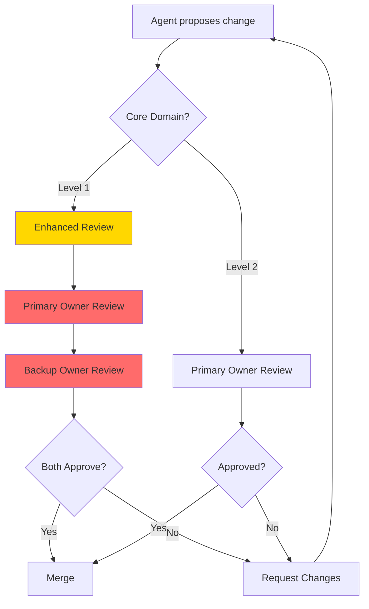

# Core Domain Ownership

**Philosophy**: *"If it breaks, we need to fix it ourselves."*

Core Domain = Business-critical code that **MUST be understood by humans**, not just AI agents.

---

## Why This Matters

### The Problem

AI agents are excellent at generating code, but they:

- Don't understand long-term architectural implications
- Can't debug production outages at 3 AM
- Won't maintain the code 2 years from now

### The Solution

**Explicit ownership** of critical modules ensures:

- ✅ At least 2 humans understand each core module
- ✅ Changes require enhanced review process
- ✅ Knowledge isn't locked in agent prompts
- ✅ Team can recover from agent mistakes

---

## Core Modules (Human-Owned)

### Level 1: Critical (2+ humans required)

> [!CAUTION] **Mission-Critical**
>
> If these modules break, the entire system fails. Changes require approval from both primary **and** backup owner.

| Module                 | Responsibility                      | Primary Owner | Backup Owner |
|:-----------------------|:------------------------------------|:--------------|:-------------|
| `cue_core::parser`     | Markdown frontmatter + content parsing | TBD        | TBD          |
| `cue_core::graph`      | DAG resolution, cycle detection     | TBD           | TBD          |
| `cue_config`           | Configuration cascading logic       | TBD           | TBD          |
| `cue_common::errors`   | Error taxonomy and conversion       | TBD           | TBD          |

**Why Critical**:

- **Parser**: All data ingestion depends on correct parsing. Bug = data corruption.
- **Graph**: Cycle bugs cause infinite loops, stack overflows.
- **Config**: Wrong config = wrong behavior everywhere.
- **Errors**: Poor error messages = users can't debug, support burden.

---

### Level 2: Important (1+ human required)

> [!IMPORTANT] **High Impact**
>
> Changes affect user experience or system stability. Require approval from primary owner.

| Module                | Responsibility                  | Primary Owner |
|:----------------------|:--------------------------------|:--------------|
| `cue_mcp::router`     | MCP request routing + validation | TBD          |
| `cue_cli::commands`   | CLI command dispatch            | TBD           |
| `cue_core::cache`     | Cache invalidation strategy     | TBD           |
| `cue_core::search`    | Fuzzy search scoring algorithm  | TBD           |

**Why Important**:

- **MCP Router**: Wrong routing = broken MCP integration, hard to debug.
- **CLI Commands**: User-facing, bugs annoy users immediately.
- **Cache**: Stale cache = incorrect results, hard to reproduce.
- **Search**: Poor ranking = frustrated users, manual filtering needed.

---

## Rules for Core Domain Changes

### 1. Change Requirements

For **Level 1** (Critical) modules, agent **MUST** provide:

#### 📄 Detailed Explanation

```markdown
## Core Domain Change Proposal

**Module**: `cue_core::parser`  
**Type**: Bug Fix / Feature / Refactor  
**Severity**: Critical / High / Medium

### Problem
[Describe the issue or need]

### Root Cause
[Technical explanation of why current behavior is wrong]

### Proposed Solution
[High-level approach, alternatives considered]

### Implementation Details
```rust
// Before (problematic code)
fn parse_frontmatter(content: &str) -> Result<Metadata> {
    // Current implementation
}

// After (fixed code)
fn parse_frontmatter(content: &str) -> Result<Metadata> {
    // New implementation with fix
}
```

### Alternatives Considered

1. **Option A**: [Description] - Rejected because [reason]
2. **Option B** (Chosen): [Description] - Chosen because [reason]

```

#### 🧪 Test Strategy

```markdown
### Test Coverage

**Unit Tests**:
- `test_parse_valid_frontmatter_with_all_fields`
- `test_parse_empty_frontmatter_returns_error`
- `test_parse_malformed_yaml_returns_diagnostic`

**Integration Tests**:
- `test_full_task_parsing_with_dependencies`
- `test_parse_and_graph_resolution_end_to_end`

**Property-Based Tests** (if applicable):
```rust
proptest! {
    #[test]
    fn test_parse_roundtrip(content in any_markdown()) {        let parsed = parse(content)?;
        let serialized = serialize(parsed)?;
        assert_eq!(parse(serialized)?, parsed);
    }
}
```

**Regression Tests**:

- Add test case for the specific bug being fixed

```

#### 📊 Impact Analysis

```markdown
### Affected Modules
- `cue_core::graph` (consumes parsed metadata)
- `cue_mcp::tools::read_doc` (reads parsed tasks)
- `cue_cli::commands::create` (creates tasks)

### Breaking Changes
- [ ] None
- [ ] API signature change (requires migration)
- [ ] Data format change (requires cache invalidation)

### Performance Impact
- Benchmark: `parse_frontmatter` before = 50μs, after = 48μs (-4%)
- No significant regression

### Security Implications
- Input validation added for frontmatter fields
- Prevents YAML deserialization attacks
```

### 2. Review Flow



**Timeline**:

- Level 2: 1-2 business days review
- Level 1: 2-4 business days (requires 2 approvals)

---

## Periphery Modules (Agent-Friendly)

These modules **CAN be agent-generated** with lighter review:

| Module                     | Why Agent-Friendly                          |
|:---------------------------|:--------------------------------------------|
| `cue_cli::cli.rs`          | Argument parsing (declarative via `clap`)   |
| `cue_common::types.rs`     | JSON serialization (derive macros)          |
| `cue_test_helpers`         | Test utilities (low risk)                   |
| `docs/**/*.md`             | Documentation (reviewable by humans easily) |
| `benches/**/*.rs`          | Benchmarks (non-production code)            |

**Rule**: Agent can modify freely, human **spot-checks** for quality (not correctness).

**Review Process** (Lightweight):

1. Agent generates code
2. Automated tests pass
3. Human scans diff for obvious issues (< 5 min)
4. Merge if no red flags

---

## Knowledge Transfer Checklist

> [!IMPORTANT] **For Each Core Module**
>
> Ensure knowledge isn't siloed in one person's head.

### General Requirements

#### Primary Owner

- [ ] **Understands architecture**: Can explain module's role in system
- [ ] **Can debug issues**: Has debugged at least 1 real production issue
- [ ] **Knows edge cases**: Aware of tricky bugs and workarounds
- [ ] **Updated documentation**: Module docs reflect current implementation

#### Backup Owner

- [ ] **Can review PRs**: Understands code well enough to spot bugs
- [ ] **Can fix minor bugs**: Capable of solo bug fixes with review
- [ ] **Has pair-programmed**: Worked with primary owner on at least 1 feature
- [ ] **Knows testing**: Can write unit + integration tests for module

### Module-Specific Checklists

#### 1. `cue_core::parser` (Critical)

- [ ] Understands **Markdown AST** (pulldown-cmark events)
- [ ] Knows **Frontmatter Specs** (YAML/TOML serialization rules)
- [ ] Can allow/block **Unsafe HTML** inputs
- [ ] Knows how **Line Offsets** are calculated for source mapping

#### 2. `cue_core::graph` (Critical)

- [ ] Understands **DAG properties** (Directed Acyclic Graph)
- [ ] Can debug **Cycle Detection** (Tarjan's algorithm or DFS)
- [ ] Knows **Topological Sort** performance characteristics
- [ ] Understands **Concurrency safety** (RwLock usage)

#### 3. `cue_config` (Critical)

- [ ] Knows **Layer Precedence** (CLI > Env > Local > Global > Default)
- [ ] Can adding **New Config Keys** without breaking backward compatibility
- [ ] Understands **Secrets Handling** (masking logs)

#### 4. `cue_mcp` (Important)

- [ ] Understands **MCP Protocol** (JSON-RPC 2.0 requests/notifications)
- [ ] Knows **Transport Layer** (Stdio vs SSE lifecycle)
- [ ] Can debug **Tool Execution** timeouts and errors

---

## Onboarding New Owners

### 4-Week Process

**Week 1: Learning**

- Read all module documentation
- Run all tests, understand test strategy
- Review last 10 PRs for module

**Week 2: Pairing**

- Pair programming with current owner
- Fix 1-2 minor bugs together
- Write tests for new edge cases

**Week 3: Solo Work**

- Fix 1 bug independently (with review)
- Add 1 small feature (non-breaking)
- Update documentation if outdated

**Week 4: Ownership Transition**

- New owner becomes primary
- Previous owner becomes backup
- Knowledge transfer complete

---

## Example: Core Domain Change

### ❌ Bad Change Request (Rejected)

```text
Agent: I updated the parser to support emoji in frontmatter.

Changes:
- Modified parse_frontmatter() to allow emoji
- Added 1 test

Please merge.
```

**Why Rejected**:

- No explanation of **why** this is needed
- No impact analysis (does graph support emoji task IDs?)
- Insufficient testing (only 1 test)
- No alternatives considered

---

### ✅ Good Change Request (Approved)

```markdown
## Core Domain Change Proposal

**Module**: `cue_core::parser`
**Type**: Feature
**Severity**: Medium

### Problem
Users want to use emoji in task titles for visual categorization.
Example: `🐛 Fix login bug`, `✨ Add dark mode`

Current parser rejects emoji, causing parse errors.

### Root Cause
Frontmatter validation uses strict alphanumeric regex:
```rust
if !title.chars().all(|c| c.is_alphanumeric() || " _-".contains(c)) {
    return Err(ValidationError::InvalidCharacters);
}
```

### Proposed Solution

Allow Unicode emoji in title field (but not in task IDs).

**Alternatives Considered**:

1. **Allow emoji in task IDs** - Rejected: breaks file-system-based lookups
2. **Strip emoji before validation** - Rejected: loses user intent
3. **Allow emoji only in title** (Chosen) - Safe, solves use case

### Implementation

```rust
fn validate_title(title: &str) -> Result<()> {
    // Allow emoji + alphanumeric + common punctuation
    if title.chars().all(|c| c.is_alphanumeric() 
                            || c.is_whitespace()
                            || "._-!?🎯🐛✨".contains(c)  // Common emoji
                            || emoji::is_emoji(c)) {
        Ok(())
    } else {
        Err(ValidationError::InvalidCharacters)
    }
}
```

### Tests

- `test_parse_title_with_emoji`
- `test_parse_task_id_rejects_emoji` (ensure IDs still strict)
- Unicode normalization tests (NFC vs NFD)

### Impact

- **Breaking**: No
- **Performance**: Negligible (emoji check is O(n))
- **Security**: No new attack surface (emoji is just Unicode)

### Migration

None required (existing titles still valid).

```

**Why Approved**:
- Clear problem statement
- Root cause analysis
- Alternatives evaluated
- Comprehensive testing
- Impact clearly documented

---

## Rollback Plan

If core domain change causes issues:

### Immediate Rollback (< 5 min)

```bash
# 1. Git revert
git revert <commit-hash>

# 2. Rebuild
cargo build --release

# 3. Verify
cargo test --package cue_core

# 4. Redeploy (if already deployed)
cue doctor  # Verify system health
```

### Post-Rollback

1. **Investigate**: Why did the change cause issues?
2. **Document**: Add to `TROUBLESHOOTING.md`
3. **Fix**: Address root cause before re-attempting
4. **Test**: Add regression test for the failure

---

## Related Docs

- [MODULE_DESIGN.md](./MODULE_DESIGN.md) - Detailed module structure
- [ARCHITECTURE_RULES.md](./ARCHITECTURE_RULES.md) - Import rules, constraints
- [CONTRIBUTING.md](../01_general/CONTRIBUTING.md) - How to submit changes
- [ENGINEERING_STANDARDS.md](../03_agent_design/ENGINEERING_STANDARDS.md) - Code quality rules
- [SECURITY_RULES.md](../04_security/SECURITY_RULES.md) - Security requirements
