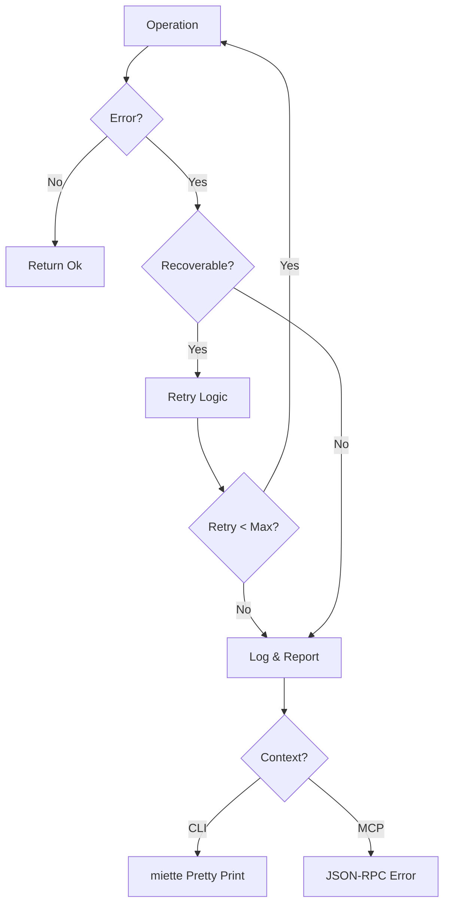

# Error Handling Strategy

## 1. Philosophy

CueDeck is a **user-facing developer tool**. Errors must be:

1. **Instructional**: Tell the user *how* to fix it, not just what broke.
2. **Structured**: Machine-readable (JSON-RPC) for MCP, pretty-printed for CLI.
3. **Traceable**: Preserve the original cause (source error).

## 2. The `CueError` Enum

Defined in `crates/cue_common/src/errors.rs`.

```rust
use miette::Diagnostic;
use thiserror::Error;

#[derive(Error, Debug, Diagnostic)]
pub enum CueError {
    #[error("Workspace not initialized")]
    #[diagnostic(code(cuedeck::workspace::missing), help("Run `cue init` to create a new workspace."))]
    WorkspaceMissing,

    #[error("File not found: {path}")]
    #[diagnostic(code(cuedeck::io::not_found))]
    FileNotFound {
        path: String,
        #[help]
        suggestion: Option<String>,
    },

    #[error("Circular Dependency Detected")]
    #[diagnostic(code(cuedeck::dag::cycle), help("Remove result reference in {cycle_path}"))]
    CircularDependency { cycle_path: String },

    #[error("Token Limit Exceeded")]
    #[diagnostic(code(cuedeck::llm::token_limit))]
    TokenLimitExceeded { current: usize, limit: usize },

    #[error("Upgrade Failed: {reason}")]
    #[diagnostic(code(cuedeck::upgrade::failed), help("Check network connection and permissions."))]
    UpgradeFailed { reason: String },

    #[error("Network Error: {message}")]
    #[diagnostic(code(cuedeck::network::error))]
    NetworkError { message: String },

    #[error(transparent)]
    Io(#[from] std::io::Error),
    
    #[error(transparent)]
    Config(#[from] config::ConfigError),
}
```

### Error Propagation Flow



## 3. Mapping Strategy

### 3.1 From 3rd Party to CueError

Use `thiserror`'s `#[from]` attribute for automatic conversion where possible. For context-aware errors, use `map_err`:

```rust
// Example: Wrapping generic IO error with Path context
pub fn read_file(path: &Path) -> Result<String, CueError> {
    std::fs::read_to_string(path).map_err(|_| CueError::FileNotFound { 
        path: path.display().to_string(), 
        suggestion: None 
    })
}
```

### 3.2 Reporting to CLI (`miette`)

In `main.rs`, return `miette::Result<()>`. This validates strictly typed errors into beautiful output.

```text
Error:   × File not found: docs/missing.md
  help: Did you mean 'docs/existing.md'?
```

### 3.3 Reporting to MCP (JSON-RPC)

When running as `cue_mcp`, errors must be serialized to JSON.

```rust
impl From<CueError> for JsonRpcError {
    fn from(err: CueError) -> Self {
        let code = match err {
            CueError::FileNotFound { .. } => 1001,
            CueError::CircularDependency { .. } => 1002,
            _ => -32603, // Internal Error
        };
        JsonRpcError { code, message: err.to_string(), data: None }
    }
}
```

## 4. Recovery Patterns

### Retry Logic

```rust
/// Retry with exponential backoff
pub async fn with_retry<T, F, Fut>(
    operation: F,
    max_retries: usize,
) -> Result<T, CueError>
where
    F: Fn() -> Fut,
    Fut: Future<Output = Result<T, CueError>>,
{
    let mut attempt = 0;
    loop {
        match operation().await {
            Ok(result) => return Ok(result),
            Err(e) if attempt < max_retries && e.is_retriable() => {
                attempt += 1;
                let delay = Duration::from_millis(100 * 2_u64.pow(attempt as u32));
                tokio::time::sleep(delay).await;
            }
            Err(e) => return Err(e),
        }
    }
}
```

### Retriable vs Non-Retriable Errors

| Error Type | Retriable | Max Retries |
| :--- | :--- | :--- |
| `NetworkError` | ✅ Yes | 3 |
| `UpgradeFailed` | ✅ Yes | 2 |
| `FileNotFound` | ❌ No | 0 |
| `CircularDependency` | ❌ No | 0 |
| `TokenLimitExceeded` | ❌ No | 0 |

### Graceful Degradation

When errors occur, CueDeck attempts graceful degradation:

1. **Cache Failure**: Fall back to fresh parse (slower but functional)
2. **Token Overflow**: Prune lowest-priority content, warn user
3. **Partial Parse Failure**: Include parseable files, list failures

---
**Related Docs**: [MODULE_DESIGN.md](./MODULE_DESIGN.md), [TOOLS_SPEC.md](../04_tools_and_data/TOOLS_SPEC.md), [TROUBLESHOOTING.md](../05_quality_and_ops/TROUBLESHOOTING.md)
