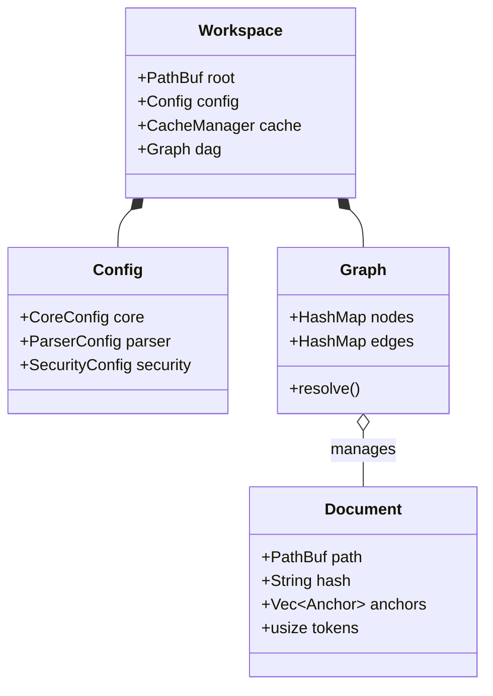

# Module Design Specification (Rust)

This document defines the Structs, Enums, and Traits for the core crates.

## Implementation References

The following table links design specifications to their actual implementations:

| Struct/Type | Implemented At | Test File |
| :---------- | :------------- | :-------- |
| `CueError` | [cue_common/src/lib.rs](file:///d:/Projects_IT/CueDeck/crates/cue_common/src/lib.rs) | - |
| `Document` | [cue_common/src/lib.rs](file:///d:/Projects_IT/CueDeck/crates/cue_common/src/lib.rs) | - |
| `Anchor` | [cue_common/src/lib.rs](file:///d:/Projects_IT/CueDeck/crates/cue_common/src/lib.rs) | - |
| `Config` | [cue_config/src/lib.rs](file:///d:/Projects_IT/CueDeck/crates/cue_config/src/lib.rs) | - |
| `TokenBudgets` | [cue_config/src/lib.rs](file:///d:/Projects_IT/CueDeck/crates/cue_config/src/lib.rs) | - |
| `parse_file()` | [cue_core/src/lib.rs](file:///d:/Projects_IT/CueDeck/crates/cue_core/src/lib.rs) | `tests::test_parse_file_stub` |
| `generate_scene()` | [cue_core/src/lib.rs](file:///d:/Projects_IT/CueDeck/crates/cue_core/src/lib.rs) | - |
| `search_workspace()` | [cue_core/src/context.rs](file:///d:/Projects_IT/CueDeck/crates/cue_core/src/context.rs) | `context::tests::test_search_workspace` |
| `JsonRpcRequest` | [cue_mcp/src/lib.rs](file:///d:/Projects_IT/CueDeck/crates/cue_mcp/src/lib.rs) | `tests::test_ping` |
| `handle_request()` | [cue_mcp/src/lib.rs](file:///d:/Projects_IT/CueDeck/crates/cue_mcp/src/lib.rs) | `tests::test_ping` |
| CLI Commands | [cue_cli/src/main.rs](file:///d:/Projects_IT/CueDeck/crates/cue_cli/src/main.rs) | - |

> [!NOTE]
> This table maps design documents to scaffold implementations. Full implementations will be added as development progresses.

---

## 1. `cue_core` (The Brain)

### Constants

```rust
pub const TOKEN_LIMIT_DEFAULT: usize = 32_000;
pub const WORKSPACE_DIR: &str = ".cuedeck";
```

### Crate Dependency Graph

```mermaid
graph TD
    CLI[cue_cli] --> Core[cue_core]
    CLI --> Config[cue_config]
    CLI --> Common[cue_common]
    
    MCP[cue_mcp] --> Core
    MCP --> Common
    
    Core --> Config
    Core --> Common
    
    Config --> Common
    
    style Common fill:#f9f,stroke:#333 -- Foundation
```

### Structs

```rust
#[derive(Debug, Serialize, Deserialize)]
pub struct Document {
    pub path: PathBuf,
    pub hash: String, // SHA256 hex
    pub anchors: Vec<Anchor>,
    pub frontmatter: Option<serde_yaml::Value>,
    pub tokens: usize,
}

#[derive(Debug, Serialize, Deserialize)]
pub struct Anchor {
    pub slug: String, // e.g., "Login Flow" -> "login-flow"
    pub header: String, // Original Text
    pub level: u8, // 1-6
    pub start_line: usize,
    pub end_line: usize,
}

pub struct Workspace {
    pub root: PathBuf,
    pub config: Config,
    pub cache: CacheManager,
    pub dag: Graph,
}
```

### Core Data Structures (Class Diagram)



### Traits

```rust
/// A source that can provide context snippets based on queries.
/// 
/// # Errors
/// 
/// All methods return `Result<T, CueError>` with the following possible errors:
/// 
/// * `CueError::FileNotFound` (code 1001) - If the requested file/path does not exist
/// * `CueError::TokenLimit` (code 1003) - If the result would exceed token budget  
/// * `CueError::StaleCache` (code 1006) - If cached data is outdated (hash mismatch)
/// * `CueError::IoError` - For generic I/O failures
/// A source that can provide context snippets based on queries.
pub mod context {
    /// Search for context snippets matching the query.
    /// 
    /// # Arguments
    /// * `root` - Workspace root path
    /// * `query` - Search terms
    /// 
    /// # Returns
    /// Top 10 documents ordered by relevance score (Filename > Content)
    pub fn search_workspace(root: &Path, query: &str) -> Result<Vec<Document>>;
}
```

### Struct Invariants

#### `Document` Invariants

- **hash**: Must be valid SHA-256 hex string (64 characters, lowercase)
- **anchors**: Must be sorted by `start_line` (ascending order)
- **tokens**: Must be ≥ 0, recalculated when content changes
- **path**: Must be normalized absolute path or workspace-relative path
- **frontmatter**: If present, must be valid YAML

**Edge Cases**:

- Empty document (0 anchors): Valid, tokens = minimal overhead
- Document with only frontmatter: Valid, anchors = []
- Duplicate anchor names: Allowed, distinguished by line numbers

#### `Anchor` Invariants

- **level**: Must be in range [1, 6] (markdown heading levels)
- **start_line**: Must be > 0 (1-indexed)
- **end_line**: Must satisfy `end_line >= start_line`
- **header**: Cannot be empty string
- **slug**: Must be URL-safe (lowercase, hyphens, no special chars)

**Edge Cases**:

- Anchor at EOF: `end_line` = last line of file
- Adjacent anchors: `anchor1.end_line + 1 = anchor2.start_line`
- Nested anchors: Level 2 under Level 1 is valid

#### `Workspace` Invariants

- **root**: Must exist and be a directory
- **config**: Must be valid (validated on load)
- **dag**: Must be acyclic (enforced by cycle detection)
- **cache**: Hash consistency maintained by CacheManager

**Edge Cases**:

- Empty workspace (.cuedeck exists but no cards/docs): Valid
- Workspace with only archived cards: Valid, dag may be empty
- Corrupted cache: Auto-rebuild triggered on hash mismatch

## 2. `cue_config` (Settings)

### Config Structs

```rust
#[derive(Debug, Deserialize, Clone)]
pub struct Config {
    pub core: CoreConfig,
    pub parser: ParserConfig,
    pub security: SecurityConfig,
    pub mcp: McpConfig,
}

// Sub-structs mirror the TOML structure in CONFIGURATION_REFERENCE.md
```

## 3. `cue_mcp` (The Server)

### Enums

```rust
#[derive(Deserialize)]
#[serde(tag = "method", content = "params")]
pub enum McpRequest {
    #[serde(rename = "read_context")]
    ReadContext { query: String, limit: Option<usize> },
    
    #[serde(rename = "read_doc")]
    ReadDoc { path: String, anchor: Option<String> },

    #[serde(rename = "list_tasks")]
    ListTasks { status: Option<String> },

    #[serde(rename = "update_task")]
    UpdateTask { id: String, updates: serde_json::Value },
}
```

## 3. `cue_cli` (The Interface)

### Clap Commands

```rust
#[derive(Parser)]
#[command(author, version, about)]
pub struct Cli {
    #[command(subcommand)]
    pub command: Commands,
}

#[derive(Subcommand)]
pub enum Commands {
    /// Initialize a new CueDeck workspace
    Init,
    /// Open the Fuzzy Finder for context
    Open { query: Option<String> },
    /// Generate the full SCENE.md context
    Scene {
        #[arg(long, short)]
        dry_run: bool,
        #[arg(long)]
        token_limit: Option<usize>,
    },
    /// Start the file watcher daemon
    Watch,
    /// Check workspace health
    Doctor,
    /// Manage Task Cards
    Card {
        #[command(subcommand)]
        cmd: CardCommands,
    },
    /// Clean cache directory
    Clean,
    /// Self-update to latest version
    Upgrade,
    /// Start MCP Server (AI Integration)
    Mcp,
}

#[derive(Subcommand)]
pub enum CardCommands {
    /// Create a new task card
    New { title: String },
}
```

## 4. Core Engine Structures (Extended)

### Dependency Graph

```rust
/// Graph of file dependencies for resolution
pub struct DependencyGraph {
    /// File path -> FileNode mapping
    pub nodes: HashMap<PathBuf, FileNode>,
    /// File path -> list of dependents
    pub edges: HashMap<PathBuf, Vec<PathBuf>>,
    /// Detected circular dependencies
    pub circular_deps: Option<Vec<(PathBuf, PathBuf)>>,
}

/// Metadata for each file in the graph
pub struct FileNode {
    pub path: PathBuf,
    pub hash: String,
    pub size: usize,
    pub language: String,
    pub imports: Vec<String>,
    pub exports: Vec<String>,
    pub is_test: bool,
    pub is_generated: bool,
    pub last_modified: DateTime<Utc>,
}
```

### File Index

```rust
/// Quick lookup index for file metadata
pub struct FileIndex {
    /// Path -> metadata mapping
    pub entries: HashMap<PathBuf, FileIndexEntry>,
}

pub struct FileIndexEntry {
    pub hash: String,
    /// Importance score (0.0 - 1.0)
    pub importance: f32,
    pub recently_used: bool,
    pub modification_count: u32,
}

pub struct Pruner {
    pub max_tokens: usize,
    pub strategy: PruningStrategy, // Knapsack, Greedy, etc.
}

pub struct SecretGuard {
    pub patterns: Vec<Regex>,
    pub whitelist: Vec<String>,
}
```

### Session State

```rust
/// Persistent session state for context continuity
pub struct SessionState {
    pub session_id: String,
    pub start_time: DateTime<Utc>,
    pub last_access: DateTime<Utc>,
    pub workflow: String,
    pub current_step: u8,
    
    /// Files in current working set
    pub working_set: Vec<WorkingSetFile>,
    /// Decisions made during session
    pub decisions: Vec<Decision>,
    /// Active assumptions
    pub assumptions: Vec<Assumption>,
    
    /// Checksum to detect stale context
    pub context_checksum: String,
    pub tokens_used: usize,
    pub max_tokens: usize,
}

pub struct WorkingSetFile {
    pub path: PathBuf,
    pub hash: String,
    pub role: FileRole,
    pub timestamp: DateTime<Utc>,
    pub importance: f32,
}

pub enum FileRole {
    Read,
    Write,
    Both,
}

pub struct Decision {
    pub id: String,
    pub timestamp: DateTime<Utc>,
    pub decision: String,
    pub rationale: String,
    pub alternatives: Vec<String>,
    pub affects: Vec<PathBuf>,
    pub reversible: bool,
}

pub struct Assumption {
    pub id: String,
    pub assumption: String,
    pub source: String,
    pub validated: bool,
    pub impact: Impact,
    pub status: AssumptionStatus,
}

pub enum Impact { Low, Medium, High }
pub enum AssumptionStatus { Active, Invalidated, Resolved }
```

### Workflow Execution

```rust
/// State machine for multi-step workflows
pub struct WorkflowExecution {
    pub id: String,
    pub workflow: String,
    pub status: ExecutionStatus,
    pub steps: Vec<StepExecution>,
    pub current_step: WorkflowStep,
    pub started_at: DateTime<Utc>,
    pub completed_at: Option<DateTime<Utc>>,
}

pub enum ExecutionStatus {
    Pending,
    InProgress,
    Completed,
    Failed,
}

pub enum WorkflowStep {
    Specification,
    Planning,
    Implementation,
    Review,
    Integration,
}

pub struct StepExecution {
    pub name: WorkflowStep,
    pub status: ExecutionStatus,
    pub started_at: Option<DateTime<Utc>>,
    pub completed_at: Option<DateTime<Utc>>,
    pub output: Option<String>,
    pub tokens_used: Option<usize>,
    pub errors: Vec<String>,
}
```

---
**Related Docs**: [SYSTEM_ARCHITECTURE.md](./SYSTEM_ARCHITECTURE.md), [API_DOCUMENTATION.md](../04_tools_and_data/API_DOCUMENTATION.md)
