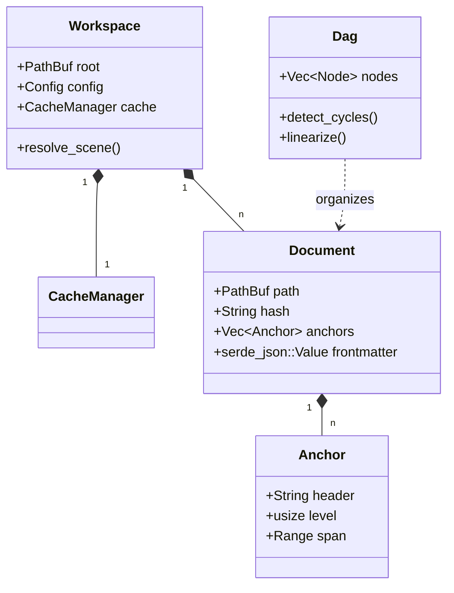

# System Architecture

## 1. Workspace Structure

The project follows a modular Rust Workspace architecture:

```text
cuedeck-workspace/
├── Cargo.toml              # Workspace Definition
├── crates/
│   ├── cue_common/         # Shared Types, Enums, Constants, Custom Errors.
│   ├── cue_config/         # Configuration logic (Load/Merge).
│   ├── cue_core/           # Logic: Parser, Cache, DAG, Security.
│   ├── cue_mcp/            # MCP Server (JSON-RPC over Stdio).
│   └── cue_cli/            # User Interface (CLI/TUI).
```

## 2. Data Flow

### Inputs

- **User**: CLI Commands (`cue open`, `cue scene`) or TUI interactions.
- **AI Agent**: MCP Protocol requests via Stdio.
- **File Watcher**: Real-time file system events.

### Processing Core (Rust)

1. **Incremental Parser**: Checks SHA256 of files. Re-parses only on change.
2. **Dependency Resolver**: Builds a Directed Acyclic Graph (DAG) to handle `@ref` includes. Detects cycles.
3. **Context Pruning**: Trims content to fit within the configured Token Budget using `tiktoken`.
4. **Security Guard**: Scans for and redacts regex-matched secrets (API keys, env vars).

### Storage

- **Source of Truth**: Markdown files in `.cuedeck/cards/` and `.cuedeck/docs/`.
- **Cache**: JSON metadata in `.cuedeck/.cache/metadata.json`.

### Outputs

- **Passive**: `.cuedeck/SCENE.md` (and System Clipboard).
- **Active**: JSON-RPC responses to MCP Clients.

## 3. Core Logic Details

### 3.1 Incremental Parser & Lazy GC (The "Hot Path")
>
> **Detailed Logic**: See [`ALGORITHMS.md#1-context-resolution-dag`](./ALGORITHMS.md)

- **Goal**: `<5ms` latency for file updates.
- **Mechanism**: Use SHA256 hashing to skip parsing unchanged files.
- **Lazy GC**: Self-healing cache that purges "Zombie" entries on access.

### 3.2 Granular Reference Resolution
>
> **Detailed Logic**: See [`ALGORITHMS.md#3-anchor-extraction`](./ALGORITHMS.md)

- **Syntax**: `@doc/api#Error Handling`
- **Method**: AST Traversal using `pulldown-cmark`. Stops at sibling headers.

### 3.3 Context Pruning (Token Budgeting)
>
> **Detailed Logic**: See [`ALGORITHMS.md#2-token-pruning`](./ALGORITHMS.md)

- **Problem**: Context > LLM Window.
- **Solution**: Greedy Knapsack algorithm prioritizing Active Cards and Direct References.

### 3.4 Security & Cascading Config
>
> **Detailed Logic**: See [`ALGORITHMS.md#4-security-guard`](./ALGORITHMS.md)

- **Secret Guard**:
  - Runs as a final filter on the Output Buffer.
  - Regex: `(sk-[a-zA-Z0-9]{20,})` -> `sk-***`.
- **Config Merge Strategy**:
  - This allows per-command overrides (`cue scene --token-limit 1000`) without editing files.

## 4. Class Structure (Generic)



---
**Related Docs**: [ALGORITHMS.md](./ALGORITHMS.md), [TECH_STACK.md](./TECH_STACK.md), [WORKFLOWS.md](./WORKFLOWS.md), [SECURITY.md](./SECURITY.md)
