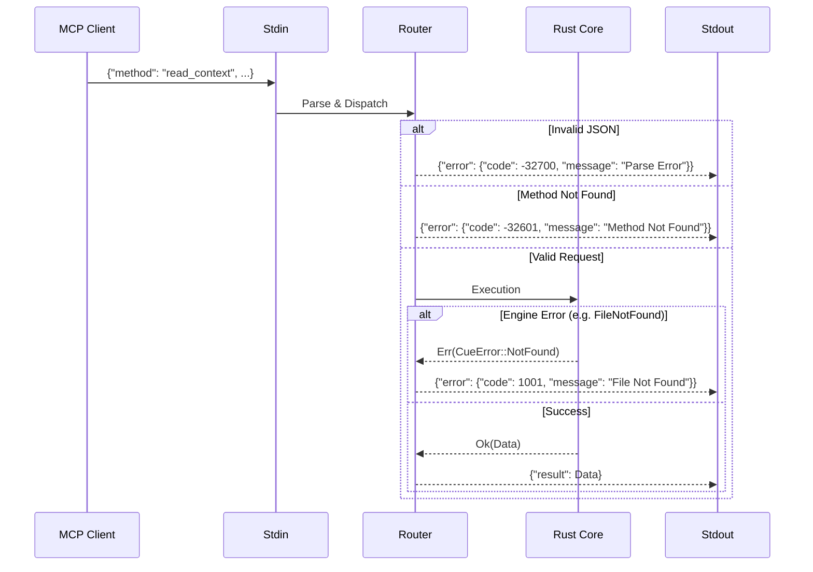

# Workflows

## 1. Scene Generation (`cue scene`)

This is the core workflow to generate context for LLMs.

1. **Scan**: Identify active cards/docs based on status or user selection.
2. **Resolve**: Build DAG of references. Check for cycles.
3. **Parses**:
    * Calculate file Hash.
    * Check Cache.
    * If Miss/Changed: Parse AST -> Extract Tokens/Anchors -> Update Cache.
4. **Prune**: Calculate total tokens. If > Limit, prioritize content (exact heuristics TBD, likely priority tags > direct path > referenced path).
5. **Mask**: Regex scan for secrets.
6. **Render**: Output to `SCENE.md` and Clipboard.

## 2. Real-time Watcher (`cue watch`)

1. **Init**: specific paths monitored by `notify`.
2. **Event**: File Modify/Create/Delete detected.
3. **Debounce**: Wait small window (e.g., 500ms) to aggregate rapid saves.
4. **Trigger**: Execute "Scene Generation" workflow (in-memory).
5. **Sync**: Write result to Clipboard.

## 3. MCP Request Handling (The "AI Interface")

**Constraint**: Strict I/O Isolation.

* **STDOUT**: Reserved EXCLUSIVELY for JSON-RPC 2.0 Responses.
* **STDERR**: Reserved for App Logs (Info/Warn/Error).
* **STDIN**: Input stream for JSON-RPC Requests.

### Sequence

1. **Transport Layer**: `cue_mcp` starts a Tokio Runtime over `stdin/stdout`.
2. **Request Parsing**:
    * Deserialize JSON.
    * Validate `jsonrpc: "2.0"` and `method` existence.
3. **Transport Layer**: `cue_mcp` starts a Tokio Runtime over `stdin/stdout`.
4. **Request Parsing**:
    * Deserialize JSON.
    * Validate `jsonrpc: "2.0"` and `method` existence.
5. **Router Dispatch**:
    * `read_context(query)`: Invokes **Search Engine** (Skim/Fuzzy on Headers).
    * `read_doc(path, anchor)`: Invokes **Parser** (Specific file + AST Slice).
    * `list_tasks(status)`: Scans `.cuedeck/cards/*.md` frontmatter.
    * `update_task(id, status)`: Rewrites Frontmatter (atomic write).
6. **Serialization**: Result object is wrapped in JSON-RPC Response.
7. **Transmission**: `println!("{}", response)` (Flushed immediately).

### Diagram: MCP Lifecycle



## 4. Automation: The "Watcher" Loop

1. **Spawn**: `cue watch` daemonizes.
2. **Monitor**: `notify` crate watches `./` (recursively, ignoring `.git` and `.cache`).
3. **Event Damping**:
    * Receive event: `Write(filepath)`.
    * **Debounce**: Reset 500ms timer. If new event comes, reset again.
4. **Execute**:
    * Timer expires -> Run `cue scene` logic in-memory.
    * Update internal State.
5. **Sync**:
    * Push new "Scene" text to System Clipboard (`arboard`).
    * Print "Context Updated: [Timestamp]" to `stderr` (visible in terminal).

### Diagram: Watcher Logic

```mermaid
graph TD
    A[Start 'cue watch'] --> B{File Changed?};
    B -- No --> B;
    B -- Yes --> C[Reset Debounce Timer (500ms)];
    C --> D{New Event?};
    D -- Yes --> C;
    D -- No --> E[Trigger Re-Build];
    E --> F[Diff Hash];
    F -- Changed --> G[Update SCENE.md];
    F -- Same --> B;
    G --> H[Write to Clipboard];
    H --> B;
```
