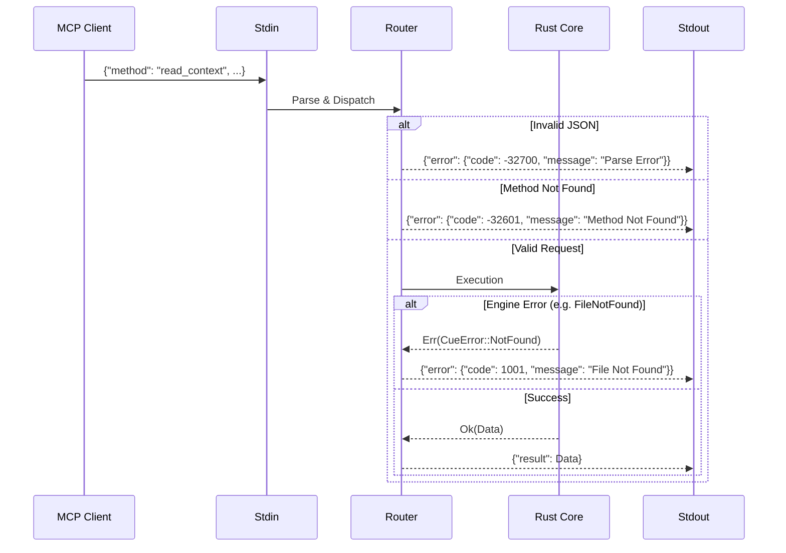

# Workflows

## 1. Scene Generation (`cue scene`)

This is the core workflow to generate context for LLMs.

1. **Scan**: Identify active cards/docs based on status or user selection.
2. **Resolve**: Build DAG of references. Check for cycles.
3. **Parses**:
    * Calculate file Hash.
    * Check Cache.
    * If Miss/Changed: Parse AST -> Extract Tokens/Anchors -> Update Cache.
4. **Prune**: Calculate total tokens. If > Limit, prioritize content using the detailed algorithm below.

### Token Pruning Algorithm (Detailed)

```text
Algorithm: PRUNE_SCENE(nodes, token_limit)
─────────────────────────────────────────────
Input: Topologically sorted nodes, budget N
Output: Pruned node list fitting budget

1. priority_groups ← classify_by_depth(nodes)
   - GROUP_0: [root card] (Priority 100)
   - GROUP_1: [direct refs depth=1] (Priority 50)
   - GROUP_2: [indirect refs depth≥2] (Priority 25)

2. buffer ← EMPTY
   used_tokens ← 0

3. FOR EACH group IN [GROUP_0, GROUP_1, GROUP_2]:
     FOR EACH node IN group:
       estimated ← count_tokens(node.content)
       
       IF used_tokens + estimated ≤ token_limit THEN:
         buffer.append(node)
         used_tokens += estimated
       ELSE:
         buffer.append("[!WARNING] Context truncated")
         BREAK
     
     IF used_tokens ≥ token_limit THEN BREAK

4. RETURN buffer, used_tokens
```

**Optimization**: Anchor-level pruning

* If full file exceeds budget, include only referenced anchors
* Example: `docs/api.md#Login` includes only Login section, not entire file

1. **Mask**: Regex scan for secrets.
2. **Render**: Output to `SCENE.md` and Clipboard.

## 2. Real-time Watcher (`cue watch`)

1. **Init**: specific paths monitored by `notify`.
2. **Event**: File Modify/Create/Delete detected.
3. **Debounce**: Wait small window (e.g., 500ms) to aggregate rapid saves.
4. **Trigger**: Execute "Scene Generation" workflow (in-memory).
5. **Sync**: Write result to Clipboard.

## 3. MCP Request Handling (The "AI Interface")

**Constraint**: Strict I/O Isolation.

* **STDOUT**: Reserved EXCLUSIVELY for JSON-RPC 2.0 Responses.
* **STDERR**: Reserved for App Logs (Info/Warn/Error).
* **STDIN**: Input stream for JSON-RPC Requests.

### Sequence

1. **Transport Layer**: `cue_mcp` starts a Tokio Runtime over `stdin/stdout`.
2. **Request Parsing**:
    * Deserialize JSON.
    * Validate `jsonrpc: "2.0"` and `method` existence.
3. **Router Dispatch**:
    * `read_context(query)`: Invokes **Search Engine** (Skim/Fuzzy on Headers).
    * `read_doc(path, anchor)`: Invokes **Parser** (Specific file + AST Slice).
    * `list_tasks(status)`: Scans `.cuedeck/cards/*.md` frontmatter.
    * `update_task(id, status)`: Rewrites Frontmatter (atomic write).
4. **Serialization**: Result object is wrapped in JSON-RPC Response.
5. **Transmission**: `println!("{}", response)` (Flushed immediately).

### Diagram: MCP Lifecycle



## 4. Automation: The "Watcher" Loop

1. **Spawn**: `cue watch` daemonizes.
2. **Monitor**: `notify` crate watches `./` (recursively, ignoring `.git` and `.cache`).
3. **Event Damping**:
    * Receive event: `Write(filepath)`.
    * **Debounce**: Reset 500ms timer. If new event comes, reset again.
4. **Execute**:
    * Timer expires -> Run `cue scene` logic in-memory.
    * Update internal State.
5. **Sync**:
    * Push new "Scene" text to System Clipboard (`arboard`).
    * Print "Context Updated: [Timestamp]" to `stderr` (visible in terminal).

### Diagram: Watcher Logic

```mermaid
graph TD
    A[Start 'cue watch'] --> B{File Changed?};
    B -- No --> B;
    B -- Yes --> C[Reset Debounce Timer (500ms)];
    C --> D{New Event?};
    D -- Yes --> C;
    D -- No --> E[Trigger Re-Build];
    E --> F[Diff Hash];
    F -- Changed --> G[Update SCENE.md];
    F -- Same --> B;
    G --> H[Write to Clipboard];
    H --> B;
```

## 5. Workspace Initialization (`cue init`)

1. **Check**: Verify `.cuedeck/` doesn't exist (or `--force` flag used).
2. **Create Directories**: `.cuedeck/`, `.cuedeck/cards/`, `.cuedeck/docs/`.
3. **Create Config**: Write default `config.toml` with sensible defaults.
4. **Update .gitignore**: Append `.cuedeck/.cache` and `.cuedeck/SCENE.md`.
5. **Auto-fill Author**: Copy `author.name` from Global Config if exists.

## 6. Health Check (`cue doctor`)

Diagnostic workflow using `miette` for beautiful error reporting:

1. **Config Check**: Parse `.cuedeck/config.toml` for TOML syntax errors.
2. **Frontmatter Check**: Validate YAML frontmatter in all `.cuedeck/cards/*.md`.
3. **Path Check**: Verify all `refs:` paths point to existing files.
4. **Dead Link Check**: Ensure anchor references (e.g., `file.md#Header`) exist.
5. **Cycle Detection**: Run DFS/Tarjan's algorithm to find circular dependencies.
6. **Orphan Check**: Warn about `active` cards with no `assignee`.
7. **Report**: Output colorful summary with suggestions.

## 7. Self-Update (`cue upgrade`)

1. **Version Check**: Query release server for latest version.
2. **Compare**: If local version >= remote, exit with "Already up to date".
3. **Download**: Fetch new binary to temp location.
4. **Verify**: Check checksum/signature.
5. **Replace**: Atomic swap of binary (platform-specific).
6. **Cleanup**: Remove temp files.
