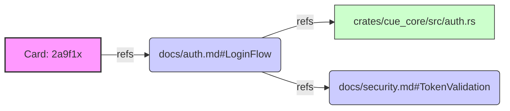

# Memory Strategy

## 1. Philosophy: "The Filesystem IS the Memory"

We reject the use of opaque Vector Databases for project management.

- **Why?** Codebases are structured trees, not semantic soup.
- **Solution**: We use the native filesystem structure + Graph Links (`refs`) as our memory model.

## 2. Memory Tiers

### Tier 1: Working Memory (The "Scene")

- **Storage**: `.cuedeck/SCENE.md` (and volatile Clipboard).
- **Content**: The *exact*, *pruned* context needed for the IMMEDIATE task.
- **Lifecycle**: Re-generated on every file save event (<500ms).
- **Analogy**: RAM.

### Tier 2: Short-Term Memory (Active Cards)

- **Storage**: `.cuedeck/cards/*.md` (Status: `active`).
- **Content**: Active tasks, current bugs, todo lists.
- **Lifecycle**: Created -> Moved to `done` -> Archived.
- **Analogy**: L1/L2 Cache.

### Tier 3: Long-Term Knowledge (Docs)

- **Storage**: `.cuedeck/docs/*.md`.
- **Content**: Architecture decisions, APIs, "Why" explanations.
- **Lifecycle**: Permanent, slowly evolving.
- **Analogy**: Hard Drive.

## 3. Retrieval Strategy: "Anchor-Walking"

Instead of "Vector Similarity", we use **Deterministic Traversal**:

1. **Entry Point**: User activates Card `2a9f1x` ("Fix Login").
2. **Explicit Link**: Card refs `docs/auth.md#LoginFlow`.
3. **Implicit Link**: `docs/auth.md` refs `crates/cue_core/src/auth.rs`.
4. **Result**: The Agent loads *exactly* those 3 nodes. No noise.

### Concrete Example: Graph Walk

**Traversal Order** (for Scene):

1. `Card: 2a9f1x` (Root - Always first)
2. `docs/auth.md#LoginFlow` (Depth 1)
3. `crates/cue_core/src/auth.rs` (Depth 2)
4. `docs/security.md#TokenValidation` (Depth 2)

### Pruning Logic

If the total exceeds the token budget:

- **Keep**: Root (Card) + Depth 1.
- **Prune**: Depth 2+ (with "Truncated" warning).

---
**Related Docs**: [ALGORITHMS.md](../02_architecture/ALGORITHMS.md), [SYSTEM_ARCHITECTURE.md](../02_architecture/SYSTEM_ARCHITECTURE.md), [GLOSSARY.md](../01_general/GLOSSARY.md)
