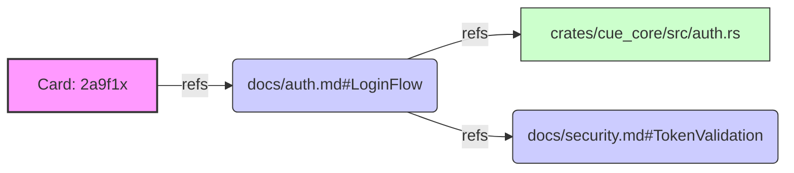

# Memory Strategy

## 1. Philosophy: "The Filesystem IS the Memory"

We reject the use of opaque Vector Databases for project management.

- **Why?** Codebases are structured trees, not semantic soup.
- **Solution**: We use the native filesystem structure + Graph Links (`refs`) as our memory model.

## 2. Memory Tiers

### Tier 1: Working Memory (The "Scene")

- **Storage**: `.cuedeck/SCENE.md` (and volatile Clipboard).
- **Content**: The *exact*, *pruned* context needed for the IMMEDIATE task.
- **Lifecycle**: Re-generated on every file save event (<500ms).
- **Analogy**: RAM.

### Tier 2: Short-Term Memory (Active Cards)

- **Storage**: `.cuedeck/cards/*.md` (Status: `active`).
- **Content**: Active tasks, current bugs, todo lists.
- **Lifecycle**: Created -> Moved to `done` -> Archived.
- **Analogy**: L1/L2 Cache.

### Tier 3: Long-Term Knowledge (Docs)

- **Storage**: `.cuedeck/docs/*.md`.
- **Content**: Architecture decisions, APIs, "Why" explanations.
- **Lifecycle**: Permanent, slowly evolving.
- **Analogy**: Hard Drive.

## 3. Retrieval Strategy: "Anchor-Walking"

Instead of "Vector Similarity", we use **Deterministic Traversal**:

1. **Entry Point**: User activates Card `2a9f1x` ("Fix Login").
2. **Explicit Link**: Card refs `docs/auth.md#LoginFlow`.
3. **Implicit Link**: `docs/auth.md` refs `crates/cue_core/src/auth.rs`.
4. **Result**: The Agent loads *exactly* those 3 nodes. No noise.

### Concrete Example: Graph Walk



**Traversal Order** (for Scene):

1. `Card: 2a9f1x` (Root - Always first)
2. `docs/auth.md#LoginFlow` (Depth 1)
3. `crates/cue_core/src/auth.rs` (Depth 2)
4. `docs/security.md#TokenValidation` (Depth 2)

### Pruning Logic

If the total exceeds the token budget:

- **Keep**: Root (Card) + Depth 1.
- **Prune**: Depth 2+ (with "Truncated" warning).

## 4. Session Persistence (Extended)

### Session State Schema

```json
{
  "sessionId": "feature-auth-123",
  "createdAt": "2025-01-15T10:00:00Z",
  "lastAccess": "2025-01-15T10:45:32Z",
  "workflow": "feature-development",
  "currentStep": 3,
  "workingSet": {
    "src/api.ts": {"hash": "abc...", "role": "read", "timestamp": "10:30:00Z"},
    "src/auth.ts": {"hash": "def...", "role": "write", "timestamp": "10:45:00Z"}
  },
  "decisions": [
    {"step": 1, "title": "Use JWT tokens", "timestamp": "10:05:00Z"},
    {"step": 2, "title": "Add to middleware", "timestamp": "10:20:00Z"}
  ],
  "contextChecksum": "xyz123"
}
```

### Storage Location

- **Session Files**: `.cuedeck/sessions/[session-id].json`
- **Compression**: LZ4 for large sessions
- **Cleanup**: Auto-cleanup after 7 days

### Continuity Mechanism

```text
When agent resumes:
1. Load session file
2. Check contextChecksum:
   - If valid: Use cached context
   - If invalid: Refresh changed files only
3. Inject session summary:
   "Continuing auth feature development. 
    Last action: Added JWT middleware. 
    Next: Integrate with login endpoint."
4. Load updated working set
```

## 5. Anti-Forgetting Mechanisms

### Progress Tracking

```text
Every 5 minutes:
- Store what was accomplished
- List pending actions
- Capture current state
- Inject reminder of current task

Prompt injection:
"Progress so far this session:
- ✅ Created user model
- ✅ Added auth middleware
- ⏳ Integrating with login endpoint
- ⏹️ Need to: Add password hashing"
```

### Decision Logging

```json
{
  "timestamp": "...",
  "decision": "Use bcrypt for password hashing",
  "rationale": "Industry standard, proven secure",
  "alternatives": ["argon2 (slower)", "simple hash (insecure)"],
  "file": "src/auth.ts",
  "impact": ["user model", "password reset flow"]
}
```

When context is tight, inject decisions:
> "Remember: We chose bcrypt because it's proven secure. This affects the user model and password reset flow."

### Assumption Validation

Track assumptions:
- "Project uses React" → Validate on new session
- "Database is PostgreSQL" → Check against config
- "API uses REST" → Confirm in architecture.md

If assumption becomes invalid:
> ⚠️ "Assumption changed: Found GraphQL endpoint. This may affect the auth implementation."

---
**Related Docs**: [ALGORITHMS.md](../02_architecture/ALGORITHMS.md), [SYSTEM_ARCHITECTURE.md](../02_architecture/SYSTEM_ARCHITECTURE.md), [GLOSSARY.md](../01_general/GLOSSARY.md)
