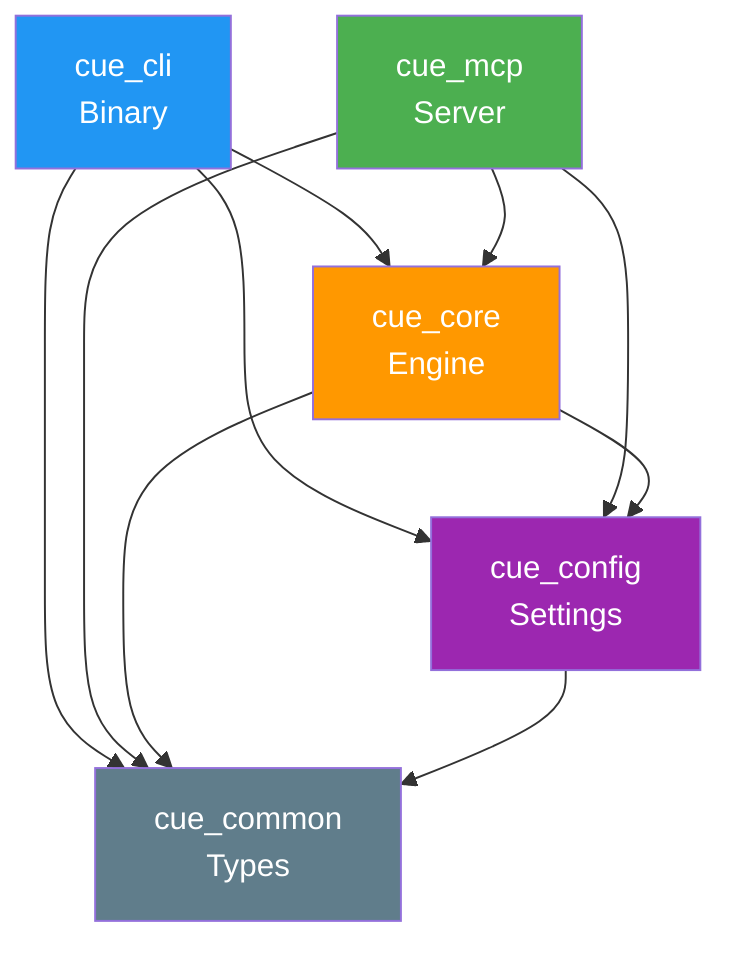

# Project Structure

## Crate Dependency Graph



## Source Code Tree (Planned)

```text
cuedeck-workspace/
├── Cargo.toml                     # Workspace definition
├── .github/
│   └── workflows/
│       └── ci.yml                 # GitHub Actions CI
│
├── crates/
│   ├── cue_common/               # FOUNDATION CRATE (no dependencies)
│   │   ├── Cargo.toml
│   │   └── src/
│   │       ├── lib.rs             # Re-exports
│   │       ├── errors.rs          # CueError enum (miette + thiserror)
│   │       └── types.rs           # Document, Anchor, Card structs
│   │
│   ├── cue_config/               # CONFIGURATION CRATE
│   │   ├── Cargo.toml
│   │   └── src/
│   │       ├── lib.rs             # Config struct + builder
│   │       └── loader.rs          # Cascading config (global → project → CLI)
│   │
│   ├── cue_core/                 # BRAIN CRATE (main logic)
│   │   ├── Cargo.toml
│   │   └── src/
│   │       ├── lib.rs             # Public API: parse(), resolve(), generate()
│   │       ├── parser.rs          # Markdown AST + Frontmatter (pulldown-cmark)
│   │       ├── dag.rs             # Reference Graph + Cycle Detection (DFS)
│   │       ├── cache.rs           # CacheManager + Lazy GC + Hash Validation
│   │       ├── search.rs          # Fuzzy Search (skim integration)
│   │       ├── scene.rs           # Scene Builder + Token Pruning (Greedy)
│   │       └── security.rs        # Secret Masking (Regex patterns)
│   │
│   ├── cue_cli/                  # CLI/TUI CRATE (user interface)
│   │   ├── Cargo.toml
│   │   └── src/
│   │       ├── main.rs            # Clap entry point + error handling
│   │       └── commands/
│   │           ├── mod.rs         # Command registry
│   │           ├── init.rs        # cue init - workspace setup
│   │           ├── open.rs        # cue open - skim TUI fuzzy finder
│   │           ├── scene.rs       # cue scene - context generation
│   │           ├── watch.rs       # cue watch - file watcher (notify)
│   │           ├── doctor.rs      # cue doctor - health diagnostics
│   │           ├── card.rs        # cue card - task management
│   │           ├── clean.rs       # cue clean - cache reset
│   │           ├── upgrade.rs     # cue upgrade - self-update
│   │           └── mcp.rs         # cue mcp - MCP server mode
│   │
│   └── cue_mcp/                  # MCP SERVER CRATE (AI integration)
│       ├── Cargo.toml
│       └── src/
│           ├── lib.rs             # Server initialization
│           ├── server.rs          # Tokio stdin/stdout loop
│           └── router.rs          # JSON-RPC dispatch + method handlers
│
├── tests/                         # Integration Tests
│   ├── snapshot_scene.rs          # Insta snapshots for scene output
│   ├── watcher_integration.rs     # tempfile + tokio async tests
│   └── mcp_protocol.rs            # JSON-RPC request/response tests
│
└── benches/                       # Performance Benchmarks
    └── scene_generation.rs        # Criterion benchmarks
```

## Key Files by Purpose

| Purpose | Primary File | Documentation |
| :--- | :--- | :--- |
| Error Definitions | `cue_common/src/errors.rs` | [ERROR_HANDLING_STRATEGY.md](../02_architecture/ERROR_HANDLING_STRATEGY.md) |
| Core Types | `cue_common/src/types.rs` | [MODULE_DESIGN.md](../02_architecture/MODULE_DESIGN.md) |
| Config Loading | `cue_config/src/loader.rs` | [CONFIGURATION_REFERENCE.md](../04_tools_and_data/CONFIGURATION_REFERENCE.md) |
| DAG Logic | `cue_core/src/dag.rs` | [ALGORITHMS.md](../02_architecture/ALGORITHMS.md) |
| Scene Generation | `cue_core/src/scene.rs` | [MEMORY_STRATEGY.md](./MEMORY_STRATEGY.md) |
| MCP Router | `cue_mcp/src/router.rs` | [TOOLS_SPEC.md](../04_tools_and_data/TOOLS_SPEC.md) |
| CLI Commands | `cue_cli/src/commands/*.rs` | [CLI_REFERENCE.md](../04_tools_and_data/CLI_REFERENCE.md) |

## Development Workflow

### Adding a New Feature

```text
1. Define types       → cue_common/src/types.rs
2. Add error variants → cue_common/src/errors.rs
3. Implement logic    → cue_core/src/[module].rs
4. Expose via CLI     → cue_cli/src/commands/[cmd].rs
5. Add MCP method     → cue_mcp/src/router.rs (if AI-facing)
6. Write tests        → tests/[feature]_integration.rs
7. Update docs        → docs/[relevant_files].md
```

### Build Commands

```bash
# Development build (fast)
cargo build

# Release build (optimized)
cargo build --release

# Run tests
cargo test --workspace

# Run benchmarks
cargo bench --bench scene_generation

# Check formatting + lints
cargo fmt --check && cargo clippy --workspace
```

## File-to-Responsibility Mapping

Comprehensive mapping of implementation files to their functional responsibilities:

### Core Engine Files

| File | Primary Responsibility | Dependencies | Public API |
| :--- | :--- | :--- | :--- |
| `cue_core/src/parser.rs` | MD→AST, YAML frontmatter | `pulldown-cmark`, `serde_yaml` | `parse_file()`, `extract_anchors()` |
| `cue_core/src/dag.rs` | Graph build, cycle detection | `petgraph` | `build_graph()`, `has_cycle()`, `toposort()` |
| `cue_core/src/cache.rs` | Hash validation, lazy GC | `sha2`, `serde_json` | `CacheManager::load()`, `invalidate()` |
| `cue_core/src/scene.rs` | Token pruning, scene assembly | `dag.rs`, `parser.rs` | `Scene::generate()`, `prune()` |
| `cue_core/src/search.rs` | Fuzzy context search | `skim`, `tantivy` (future) | `search_context()`, `rank_results()` |
| `cue_core/src/security.rs` | Secret masking | `regex` | `mask_secrets()`, `load_patterns()` |

### CLI Command Files

| File | CLI Command | User-Facing Action | Core Functions Called |
| :--- | :--- | :--- | :--- |
| `cue_cli/src/commands/init.rs` | `cue init` | Create `.cuedeck/` structure | `fs::create_dir_all()`, `Config::default()` |
| `cue_cli/src/commands/scene.rs` | `cue scene` | Generate SCENE.md | `Workspace::load()`, `Scene::generate()` |
| `cue_cli/src/commands/watch.rs` | `cue watch` | File watcher daemon | `notify::Watcher`, `Scene::generate()` |
| `cue_cli/src/commands/doctor.rs` | `cue doctor` | Health diagnostics | `DAG::has_cycle()`, `validate_config()` |
| `cue_cli/src/commands/card.rs` | `cue card new/list` | Task management | `parse_frontmatter()`, `list_cards()` |
| `cue_cli/src/commands/clean.rs` | `cue clean` | Cache invalidation | `CacheManager::clear()` |
| `cue_cli/src/commands/open.rs` | `cue open` | Fuzzy file picker | `skim::Skim::run()`, `search_context()` |

### MCP Integration Files

| File | MCP Method | JSON-RPC Spec | Core Logic |
| :--- | :--- | :--- | :--- |
| `cue_mcp/src/router.rs#read_context` | `read_context` | [TOOLS_SPEC.md#L45](../04_tools_and_data/TOOLS_SPEC.md) | `search::search_context()` |
| `cue_mcp/src/router.rs#read_doc` | `read_doc` | [TOOLS_SPEC.md#L89](../04_tools_and_data/TOOLS_SPEC.md) | `parser::parse_file()` |
| `cue_mcp/src/router.rs#list_tasks` | `list_tasks` | [TOOLS_SPEC.md#L128](../04_tools_and_data/TOOLS_SPEC.md) | `list_cards()` |
| `cue_mcp/src/router.rs#update_task` | `update_task` | [TOOLS_SPEC.md#L161](../04_tools_and_data/TOOLS_SPEC.md) | `update_frontmatter()` |

### Utility & Infrastructure Files

| File | Purpose | Usage Pattern |
| :--- | :--- | :--- |
| `cue_common/src/errors.rs` | Centralized error types | `use cue_common::CueError;` |
| `cue_common/src/types.rs` | Shared data structures | `use cue_common::{Document, Anchor};` |
| `cue_config/src/loader.rs` | Config cascade (global→local) | `Config::load()?` |
| `cue_core/src/lib.rs` | Public facade API | All external crates import via this |

---
**Related Docs**: [MODULE_DESIGN.md](../02_architecture/MODULE_DESIGN.md), [ROADMAP.md](../01_general/ROADMAP.md), [TECH_STACK.md](../02_architecture/TECH_STACK.md), [CONTRIBUTING.md](../01_general/CONTRIBUTING.md)
