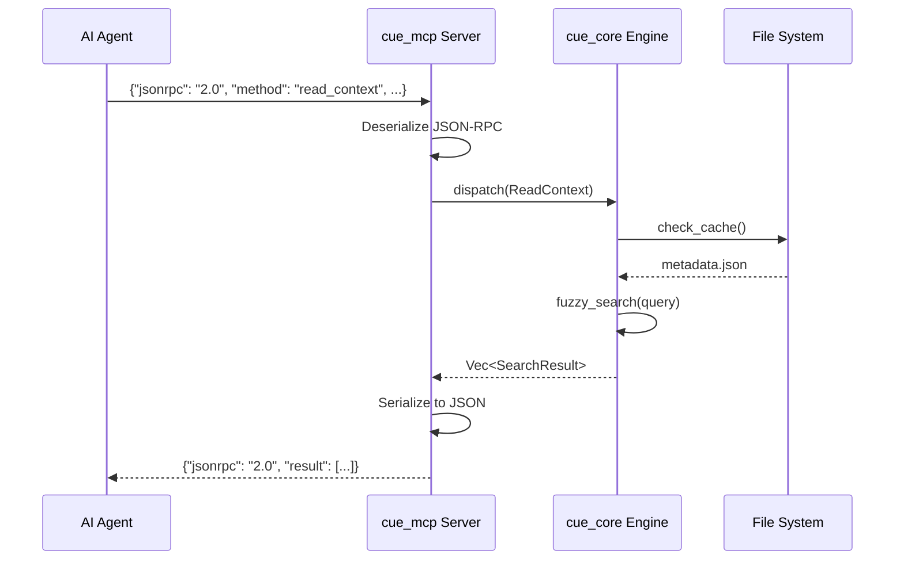

# API Documentation

## 1. MCP Interface (JSON-RPC over Stdio)

Protocol compliance: **MCP 2024-11 Draft** + **JSON-RPC 2.0**.

### Request Lifecycle

```text
Request (Stdin) -> Deserializer -> Dispatcher -> Async Handler -> Serializer -> Response (Stdout)
```

### Request/Response Sequence Diagram



### Error Codes

| Code | Message | Description | Data Schema | Recovery Steps |
| :--- | :--- | :--- | :--- | :--- |
| `-32700` | Parse Error | Invalid JSON received on stdin. | `{"position": int, "expected": string}` | Check JSON syntax |
| `-32601` | Method Not Found | Tool name typo or version mismatch. | `{"method": string, "available": [string]}` | Verify tool name |
| `1001` | File Not Found | Path exists in Cache but generic IO failed (Race Condition). | `{"path": string, "suggestion": string}` | Verify path, check permissions |
| `1002` | Cycle Detected | Graph resolution found `A -> B -> A`. | `{"cycle_path": [string], "suggestion": string}` | Remove circular reference |
| `1003` | Token Limit Exceeded | Scene is too large even after aggressive pruning. | `{"current_size": int, "limit": int, "action": string}` | Archive cards or increase limit |
| `1004` | Upgrade Failed | Self-update failed (network, permission, or checksum error). | `{"reason": string, "url": string, "checksum_expected": string}` | Check network, retry manually |
| `1005` | Network Error | Network request failed (timeout, unreachable). | `{"url": string, "timeout_ms": int, "error_detail": string}` | Check connection, retry |
| `1006` | Stale Cache | Metadata mismatch. | `{"path": string, "expected_hash": string, "actual_hash": string, "recovery": string}` | Run `cue clean` |
| `1007` | Lock Error | Could not acquire file lock. | `{"lock_file": string, "holder_pid": int, "suggestion": string}` | Close other instances |
| `1008` | Orphan Card | Active card has no assignee. | `{"card_id": string, "title": string, "suggestion": string}` | Assign user to card |
| `1009` | Rate Limited | Too many requests in time window. | `{"limit": int, "window_seconds": int, "retry_after_seconds": int}` | Wait and retry |
| `1010` | Validation Error | Input fails schema validation. | `{"field": string, "expected": string, "actual": string}` | Fix input format |

### Edge Case Examples

#### Empty Document

```json
// Request
{"jsonrpc": "2.0", "id": 1, "method": "read_doc", "params": {"path": "docs/empty.md"}}

// Response - Success with empty content
{
  "jsonrpc": "2.0",
  "id": 1,
  "result": {
    "path": "docs/empty.md",
    "content": "",
    "tokens": 0,
    "hash": "e3b0c44298fc1c149afbf4c8996fb92427ae41e4649b934ca495991b7852b855",
    "cached": true
  }
}
```

#### Non-Existent Anchor

```json
// Request - anchor doesn't exist in document
{"jsonrpc": "2.0", "id": 2, "method": "read_doc", "params": {"path": "docs/api.md", "anchor": "NonExistentSection"}}

// Response - Error 1001 with suggestion
{
  "jsonrpc": "2.0",
  "id": 2,
  "error": {
    "code": 1001,
    "message": "Anchor Not Found",
    "data": {
      "path": "docs/api.md",
      "anchor": "NonExistentSection",
      "available_anchors": ["Introduction", "API Reference", "Error Codes"],
      "suggestion": "Did you mean 'Error Codes'?"
    }
  }
}
```

#### Concurrent Access (Lock Contention)

```json
// Response when another process holds the lock
{
  "jsonrpc": "2.0",
  "id": 3,
  "error": {
    "code": 1007,
    "message": "Lock Error",
    "data": {
      "lock_file": ".cuedeck/.cache/lock",
      "holder_pid": 12345,
      "lock_age_seconds": 5,
      "suggestion": "Another CueDeck instance is running. Wait or kill PID 12345."
    }
  }
}
```

**Implementation Reference**: See [`cue_common/src/lib.rs`](file:///d:/Projects_IT/CueDeck/crates/cue_common/src/lib.rs) for `CueError` enum definition.

## 2. Rust Internal API (`crates/cue_core`)

### `Public Types`

```rust
// The Atomic Unit of Knowledge
pub struct Document {
    pub path: PathBuf,
    pub hash: String, // SHA256
    pub anchors: Vec<Anchor>,
    pub frontmatter: Option<serde_yaml::Value>,
}

// A Specific Target in the Graph
pub struct Anchor {
    pub header: String, // "API > Login"
    pub level: u8,      // 1-6
    pub start_line: usize,
    pub end_line: usize,
}
```

### `Engine API`

```rust
/// Parse a markdown file and extract metadata.
/// 
/// # Arguments
/// * `path` - Path to the markdown file
/// 
/// # Returns
/// * `Ok(Document)` - Parsed document with frontmatter and anchors
/// * `Err(CueError::FileNotFound)` - If file doesn't exist
/// 
/// # Example
/// ```rust
/// let doc = Parser::parse_file(Path::new("docs/api.md"))?;
/// println!("Found {} anchors", doc.anchors.len());
/// ```
pub fn parse_file(path: &Path) -> Result<Document, CueError>;

/// Resolve document dependencies into a DAG.
/// 
/// # Arguments
/// * `root` - The starting document (usually active task card)
/// 
/// # Returns
/// Linearized list of documents in topological order.
/// 
/// # Errors
/// * `CueError::CircularDependency` - If cycle detected
pub fn resolve(root: &Document) -> Result<Dag<Document>, CueError>;
```

### `Context Compression API`

```rust
/// Compress context to fit within token budget
pub struct ContextCompressor {
    abbreviations: HashMap<String, String>,
    token_counter: TokenCounter,
}

impl ContextCompressor {
    /// Compress with multi-stage pipeline
    /// Achieves ~40% token reduction
    pub fn compress(&self, context: &FullContext, budget: usize) 
        -> Result<CompressedContext, CueError>;
    
    /// Compression stages (in order of safety):
    /// 1. Remove comments (preserve docstrings)
    /// 2. Abbreviate keywords (async function → async fn)
    /// 3. Compress whitespace
    /// 4. Summarize long sections (>30 lines)
    /// 5. Reference by hash (large files)
}

pub struct CompressedContext {
    pub content: String,
    pub tokens_used: usize,
    pub compression_ratio: f32,
}
```

### `Validation Engine API`

```rust
/// Rules-based validation for code changes
pub struct RulesEngine {
    rules: Vec<Rule>,
    rule_cache: HashMap<String, Vec<Rule>>,
}

impl RulesEngine {
    /// Load rules from .cuedeck/security.rules
    pub fn load_rules(&mut self, path: &Path) -> Result<(), CueError>;
    
    /// Validate single file
    pub fn validate_file(&self, path: &Path, content: &str) 
        -> ValidationResult;
    
    /// Validate entire change set before commit
    pub fn validate_changes(&self, changes: &[Change]) 
        -> ChangeValidationResult;
}

pub struct ValidationResult {
    pub valid: bool,
    pub violations: Vec<Violation>,
    pub warnings: Vec<String>,
}

pub struct Violation {
    pub rule_id: String,
    pub severity: Severity,
    pub message: String,
    pub line: usize,
    pub suggestion: String,
}

pub enum Severity { Critical, High, Medium, Low }
```

### `Session Management API`

```rust
/// Manage session state for context continuity
pub struct SessionStateManager {
    state: SessionState,
    session_path: PathBuf,
}

impl SessionStateManager {
    /// Create new session for workflow
    pub fn create_session(&mut self, workflow: &str) 
        -> Result<SessionState, CueError>;
    
    /// Load existing session
    pub fn load_session(&mut self, session_id: &str) 
        -> Result<SessionState, CueError>;
    
    /// Update working set (files being modified)
    pub fn update_working_set(&mut self, files: &[PathBuf]);
    
    /// Log architectural decision
    pub fn record_decision(&mut self, 
        title: &str, 
        rationale: &str,
        alternatives: &[&str],
        affects: &[PathBuf]
    );
    
    /// Track assumption about project
    pub fn record_assumption(&mut self,
        assumption: &str,
        source: &str,
        impact: Impact
    );
    
    /// Validate all assumptions before critical decision
    pub fn validate_assumptions(&self) -> ValidateResult;
    
    /// Refresh stale context
    pub fn refresh(&mut self) -> Result<(), CueError>;
    
    /// Generate context summary for handoff
    pub fn generate_context_summary(&self) -> String;
}
```

## 3. JSON-RPC Payload Schemas

### Success Response

```json
{
  "jsonrpc": "2.0",
  "id": 1,
  "result": {
    /* Tool-specific result object */
  }
}
```

### Error Response

```json
{
  "jsonrpc": "2.0",
  "id": 1,
  "error": {
    "code": 1001,
    "message": "File Not Found",
    "data": {
      "path": "docs/missing.md",
      "suggestion": "Did you mean 'docs/api.md'?"
    }
  }
}
```

### Notification (No Response Expected)

```json
{
  "jsonrpc": "2.0",
  "method": "$/progress",
  "params": {
    "token": "build-context",
    "value": { "kind": "report", "message": "Parsing 12 files..." }
  }
}
```

---
**Related Docs**: [TOOLS_SPEC.md](./TOOLS_SPEC.md), [ERROR_HANDLING_STRATEGY.md](../02_architecture/ERROR_HANDLING_STRATEGY.md), [MODULE_DESIGN.md](../02_architecture/MODULE_DESIGN.md)
