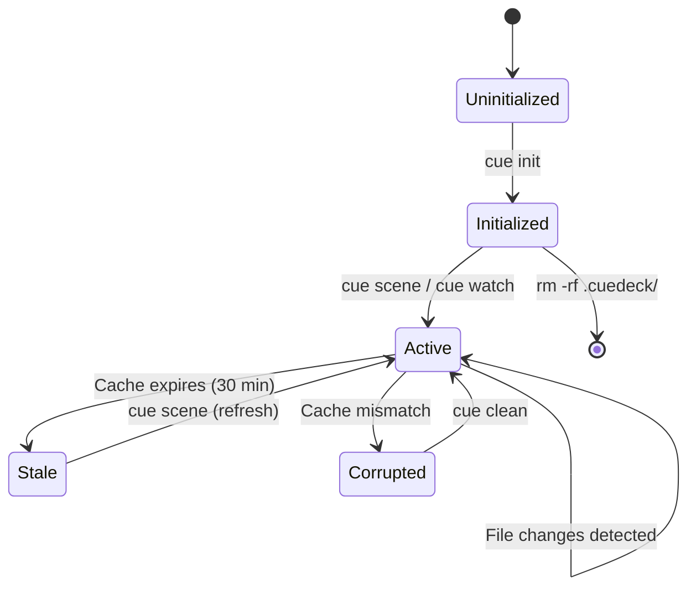
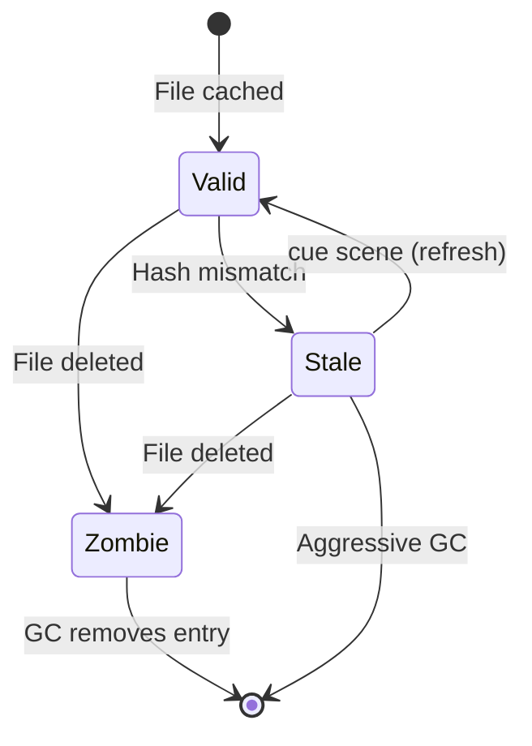

# Knowledge Base Structure

## 1. Directory Layout (The "Workspace")

```text
.cuedeck/
├── cards/                   # Ephemeral Task Cards
│   ├── 2a9f1x.md           # ID = 2a9f1x (Short)
│   └── 8b2c4z.md
├── docs/                    # Long-lived Documentation
│   ├── api.md
│   └── architecture.md
├── .cache/                  # Git-ignored Runtime State
│   ├── metadata.json       # The Brain State
│   └── logs/               # Application Logs
└── config.toml              # Local Overrides
```

### Workspace Lifecycle



## 2. Data Schemas

### A. Card Frontmatter (YAML)

**File**: `.cuedeck/cards/2a9f1x.md`

```yaml
---
id: "2a9f1x"              # REQUIRED: 6-char alphanumeric hash
uuid: "550e..."           # SYSTEM: Full V4 UUID for tracking
title: "Implement Login"  # REQUIRED: Human readable
status: "active"          # ENUM: [todo, active, done, archived]
priority: "high"          # ENUM: [low, medium, high, critical]
assignee: "user"          # OPTIONAL
refs:                     # OPTIONAL: Explicit Graph Edges
  - "docs/auth.md#Flow"   # -> Points to specific anchor
  - "crates/cue_core"     # -> Points to directory
---
```

### B. Cache Metadata (JSON)

**File**: `.cuedeck/.cache/metadata.json`

```json
{
  "version": "2.1",
  "files": {
    "docs/api.md": {
      "hash": "e3b0c44298fc1c149afbf4c8996fb92427ae41e4649b934ca495991b7852b855",
      "last_checked_ts": 1709251200,
      "token_count": 1420,
      "anchors": [
        "Authentication",
        "Authentication > Rate Limiting"
      ],
      "dependencies": [
        "docs/auth.md",
        "crates/cue_core/src/auth.rs"
      ]
    }
  }
}
```

**Key Behavior**:

- If `files[path].hash != sha256(disk_content)`, the entry is stale.
- If `path` does not exist on disk, the entry is a "Zombie" (removed on next GC).

### Data Validation Rules

| Field | Validation | Error on Fail |
| :--- | :--- | :--- |
| `id` | 6-char alphanumeric, unique | Reject card creation |
| `uuid` | Valid UUID v4 | Auto-regenerate |
| `status` | Enum: todo/active/done/archived | Default to "todo" |
| `priority` | Enum: low/medium/high/critical | Default to "medium" |
| `hash` | SHA256 hex (64 chars) | Recalculate |
| `refs[]` | Valid path or anchor syntax | Warn, skip invalid |

### C. Configuration Reference

**File**: `.cuedeck/config.toml` (or `~/.config/cuedeck/config.toml`)

> **Note**: For the full list of options, defaults, and environment variable overrides, see [`CONFIGURATION_REFERENCE.md`](./CONFIGURATION_REFERENCE.md).

```toml
[core]
token_limit = 32000

[author]
name = "Your Name"
```

### D. Scene Output (`SCENE.md`)

**File**: `.cuedeck/SCENE.md`

The compiled context output file generated by `cue scene`. This file is:

- Git-ignored by default (added by `cue init`)
- Automatically copied to clipboard
- Contains: Active cards + resolved references + masked secrets

## 3. Migration & Garbage Collection

### Version Migration Algorithm

When upgrading CueDeck, the system performs automatic schema migration with support for transitive version jumps:

```text
Algorithm: MIGRATE_METADATA(current_ver, target_ver)
──────────────────────────────────────────────────────
Input: Current version, Target version
Output: SUCCESS or ERROR with rollback

1. VALIDATE_VERSIONS:
   IF NOT is_valid_version(current_ver) OR NOT is_valid_version(target_ver) THEN:
     RETURN ERROR("Invalid version format, expected X.Y")
   
2. CHECK_IDEMPOTENT:
   metadata ← read(".cuedeck/.cache/metadata.json")
   IF metadata.version = target_ver THEN:
     RETURN SUCCESS  // Already at target version
   
3. ACQUIRE_LOCK:
   lock_file ← ".cuedeck/.cache/migration.lock"
   lock ← try_acquire_lock(lock_file, timeout=30s)
   IF NOT lock THEN:
     RETURN ERROR("Migration already in progress by another process")
   DEFER release_lock(lock)  // Ensure cleanup
   
4. BACKUP:
   timestamp ← unix_timestamp_millis()  // High precision to avoid collisions
   backup ← ".cuedeck/.cache/metadata.backup.{timestamp}.json"
   write(backup, metadata)
   
5. COMPUTE_MIGRATION_PATH:
   path ← find_migration_path(current_ver, target_ver)
   IF path is EMPTY THEN:
     RETURN ERROR("No migration path from {current_ver} to {target_ver}")
   
   // Example: 2.0 → 2.2 becomes [(2.0, 2.1), (2.1, 2.2)]
   
6. TRANSFORM_ITERATIVELY:
   FOR EACH (from_ver, to_ver) IN path:
     CASE from_ver → to_ver:
       "2.0" → "2.1":
         FOR EACH file IN metadata.files:
           file.last_checked_ts ← current_timestamp()
       
       "2.1" → "2.2":
         FOR EACH file IN metadata.files:
           file.dependencies ← resolve_dependencies(file.path)
       
       DEFAULT:
         restore(backup)
         RETURN ERROR("Unsupported migration step: {from_ver} → {to_ver}")
     
     metadata.version ← to_ver  // Update version after each step
   
7. VALIDATE_SCHEMA:
   IF NOT valid_schema(metadata, target_ver) THEN:
     restore(backup)
     RETURN ERROR("Schema validation failed for v{target_ver}")
   
8. COMMIT:
   write(".cuedeck/.cache/metadata.json", metadata)
   RETURN SUCCESS
```

**Helper Functions**:

```text
Function: find_migration_path(from, to)
───────────────────────────────────────
  known_migrations ← {("2.0", "2.1"), ("2.1", "2.2")}
  
  IF from = to THEN RETURN []
  
  path ← []
  current ← from
  WHILE current ≠ to:
    next ← find_next_version(current, known_migrations)
    IF next is NULL THEN RETURN EMPTY  // No path
    path.append((current, next))
    current ← next
  
  RETURN path
```

**Example: v2.0 → v2.1 Migration**

```diff
{
  "version": "2.0",  // Changed to "2.1"
  "files": {
    "docs/api.md": {
      "hash": "e3b0c44...",
+     "last_checked_ts": 1709251200,  // Added
      "token_count": 1420,
      "anchors": [...]
    }
  }
}
```

### Garbage Collection Algorithm

The cache manager implements lazy garbage collection to remove zombie entries, with protection against race conditions:

```text
Algorithm: GARBAGE_COLLECT(strategy, workspace_root)
────────────────────────────────────────────────────
Input: "lazy" or "aggressive", workspace root path
Output: Number of entries removed

1. NORMALIZE_PATHS:
   // Convert all relative paths to absolute to avoid CWD issues
   FOR EACH file_path IN metadata.files:
     abs_path ← workspace_root.join(file_path)
     file_path_map[file_path] ← abs_path
   
2. SCAN cache entries:
   FOR EACH file_path, abs_path IN file_path_map:
     // Get file stats (atomic check for existence + metadata)
     stat ← try_stat(abs_path)
     
     IF stat is NULL THEN:
       // File doesn't exist
       mark_as_zombie(file_path)
     ELSE:
       // File exists, check if modified
       cached_ts ← metadata.files[file_path].last_checked_ts
       disk_ts ← stat.modified_time
       
       IF disk_ts > cached_ts THEN:
         // File modified, verify hash
         disk_hash ← compute_sha256(abs_path)
         cached_hash ← metadata.files[file_path].hash
         
         IF disk_hash ≠ cached_hash THEN:
           mark_as_stale(file_path)
       
   
3. DECISION based on strategy:
   IF strategy = "lazy" THEN:
     removed ← remove_zombies()  // Only missing files
   ELSE IF strategy = "aggressive" THEN:
     removed ← remove_zombies() + remove_stale()
   
4. CLEANUP old backups:
   backups ← list(".cuedeck/.cache/metadata.backup.*.json")
   sorted_backups ← sort_by_timestamp_desc(backups)
   keep_recent(sorted_backups, count=5)
   delete_old(sorted_backups)
   
5. RETURN removed
```

**Key Improvements**:

- **TOCTOU Fix**: Uses `stat()` to atomically check existence + get timestamp
- **Path Normalization**: All paths converted to absolute before checks  
- **Timestamp Validation**: Checks modification time before expensive hash computation

**Zombie Lifecycle**:



**GC Trigger Conditions**:

| Condition | Strategy | When |
| :--- | :--- | :--- |
| `cue scene` | Lazy | Every scene generation |
| `cue clean` | Aggressive | User command |
| `cue doctor` | Aggressive | Health check |
| Cache load | Lazy | Startup validation |

### Backup Strategy

```text
Backup locations:
├── .cuedeck/.cache/metadata.backup.{timestamp}.json  # Auto before migration (keep last 5)
├── .cuedeck/.cache/sessions/*.backup.json            # Session snapshots (7-day retention)
└── .cuedeck/cards/ARCHIVE/                           # Archived task cards (manual cleanup)
```

**Retention Policy**:

- Metadata backups: Keep last 5, auto-delete older
- Session backups: 7-day rolling window
- Archived cards: Manual cleanup only

---
**Related Docs**: [MODULE_DESIGN.md](../02_architecture/MODULE_DESIGN.md), [SECURITY.md](../02_architecture/SECURITY.md), [GLOSSARY.md](../01_general/GLOSSARY.md), [MAINTENANCE_GUIDE.md](../05_quality_and_ops/MAINTENANCE_GUIDE.md)
