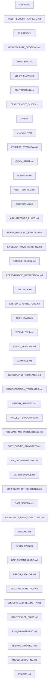

```mermaid
flowchart LR
    N0["ya3ro5.md"]
    N1["PULL_REQUEST_TEMPLATE.md"]
    N2["00_INDEX.md"]
    N3["ARCHITECTURE_DECISIONS.md"]
    N4["CHANGELOG.md"]
    N5["CLI_UX_FLOWS.md"]
    N6["CONTRIBUTING.md"]
    N7["DEVELOPMENT_GUIDE.md"]
    N8["FAQ.md"]
    N9["GLOSSARY.md"]
    N10["PROJECT_OVERVIEW.md"]
    N11["QUICK_START.md"]
    N12["ROADMAP.md"]
    N13["USER_STORIES.md"]
    N14["ALGORITHMS.md"]
    N15["ARCHITECTURE_RULES.md"]
    N16["ERROR_HANDLING_STRATEGY.md"]
    N17["IMPLEMENTATION_PATTERNS.md"]
    N18["MODULE_DESIGN.md"]
    N19["PERFORMANCE_OPTIMIZATION.md"]
    N20["SECURITY.md"]
    N21["SYSTEM_ARCHITECTURE.md"]
    N22["TECH_STACK.md"]
    N23["WORKFLOWS.md"]
    N24["AGENT_PERSONA.md"]
    N25["EXAMPLES.md"]
    N26["GOVERNANCE_TEMPLATES.md"]
    N27["IMPLEMENTATION_TEMPLATES.md"]
    N28["MEMORY_STRATEGY.md"]
    N29["PROJECT_STRUCTURE.md"]
    N30["PROMPTS_AND_INSTRUCTIONS.md"]
    N31["RUST_CODING_STANDARDS.md"]
    N32["API_DOCUMENTATION.md"]
    N33["CLI_REFERENCE.md"]
    N34["CONFIGURATION_REFERENCE.md"]
    N35["DATA_SCHEMA.md"]
    N36["KNOWLEDGE_BASE_STRUCTURE.md"]
    N37["README.md"]
    N38["TOOLS_SPEC.md"]
    N39["DEPLOYMENT_GUIDE.md"]
    N40["ERROR_CATALOG.md"]
    N41["EVALUATION_METRICS.md"]
    N42["LOGGING_AND_TELEMETRY.md"]
    N43["MAINTENANCE_GUIDE.md"]
    N44["RISK_MANAGEMENT.md"]
    N45["TESTING_STRATEGY.md"]
    N46["TROUBLESHOOTING.md"]
    N47["README.md"]
```
